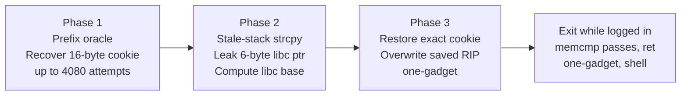
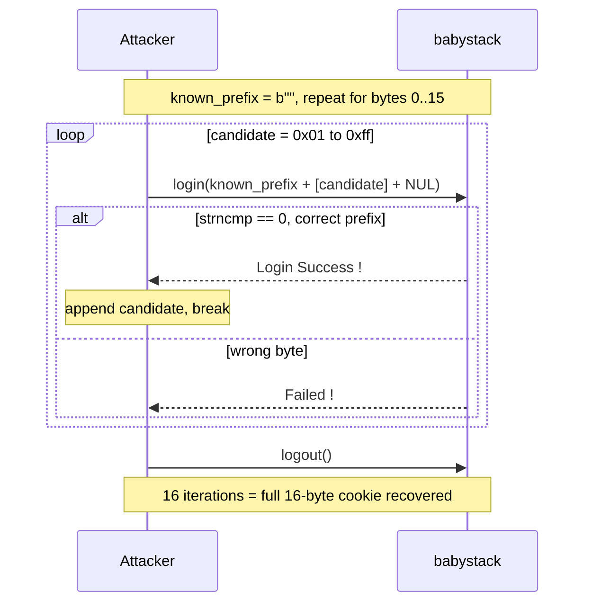

**Category:** Pwn  
**Binary:** `babystack` (x86-64 PIE, Full RELRO, NX, custom 16-byte cookie)  
**Vulnerability:** `strncmp` prefix oracle → stale-stack `strcpy` overflow → one-gadget RIP control

## Summary

`babystack` generates a 16-byte random password on the stack and exposes three menu options: login, exit, and copy (login-gated). The login check compares only as many bytes as the attacker sends, enabling both a zero-length bypass and a byte-at-a-time oracle that recovers the full password. A second bug chains an unterminated `read()` with an unbounded `strcpy()`: data staged in the login helper's stack frame bleeds into the next copy operation, overflowing `main`'s 64-byte buffer into the adjacent cookie, a stale libc return address, and finally saved RIP.

## Vulnerabilities

### Bug 1 — strncmp prefix oracle

The login function compares only `strlen(candidate)` bytes of the password:

```c
// FUN_00100def
char local_88[128];
FUN_00100ca0(local_88, 0x7f);       // read up to 127 bytes
size_t n = strlen(local_88);        // attacker controls n
int r = strncmp(local_88, secret, n);
if (r == 0) DAT_00302014 = 1;       // set login flag
```

Two consequences fall out immediately:

- **Zero-length bypass:** sending a single `\x00` makes `strlen` return 0; `strncmp(..., ..., 0)` always returns 0 → logged in without knowing the password.
- **Prefix oracle:** a correct prefix `p` satisfies `strncmp(p, secret, len(p)) == 0` and prints "Login Success !". An incorrect byte prints "Failed !". Up to 16 × 255 = 4 080 attempts recover the entire 16-byte password.

The password must still be fully recovered because `main` runs `memcmp(&local_28, mmap_copy, 16)` before returning — the stack cookie must match the original anonymous-mmap copy.

### Bug 2 — Unterminated read enables stale-stack strcpy

`read_input` (`FUN_00100ca0`) only NUL-terminates when the last byte read is a newline:

```c
ssize_t n = read(0, buf, count);
if (buf[n - 1] == '\n')
    buf[n - 1] = 0;    // NUL only on trailing newline — otherwise none appended
```

The copy handler reads into a 128-byte helper buffer, then blindly `strcpy`s into `main`'s 64-byte buffer:

```c
// FUN_00100e76
char local_88[128];
FUN_00100ca0(local_88, 0x3f);   // read ≤ 63 bytes, may be unterminated
strcpy(main_copy_buf, local_88);   // destination is only 64 bytes!
```

Because the login and copy helpers share the same stack frame layout (both have `local_88` at rbp−0x88), data written during a login call persists as stale bytes when copy runs next. A short unterminated copy input causes `strcpy` to concatenate the new bytes with those stale bytes, producing a write far longer than 64 bytes.

---

## main Stack Layout

<style>
.bs-tbl { border-collapse: collapse; width: 100%; font-family: monospace; font-size: 0.85em; margin: 1em 0; }
.bs-tbl th { background: #2563eb; color: #fff; padding: 6px 10px; text-align: left; border: 1px solid #444; }
.bs-tbl td { padding: 5px 10px; border: 1px solid #444; }
.bs-buf  { background: rgba(34,197,94,0.15);  }
.bs-cook { background: rgba(234,179,8,0.20);  }
.bs-menu { background: rgba(99,102,241,0.15); }
.bs-rbp  { background: rgba(249,115,22,0.15); }
.bs-rip  { background: rgba(239,68,68,0.20);  }

/* strcpy animation */
@keyframes bs-safe { from { opacity:0; background: rgba(34,197,94,0.05); } to { opacity:1; background: rgba(34,197,94,0.22); } }
@keyframes bs-ov   { from { opacity:0; background: transparent; } 50% { background: rgba(239,68,68,0.7); } to { background: rgba(239,68,68,0.42); } }
@keyframes bs-libc { from { opacity:0; background: transparent; } 50% { background: rgba(249,115,22,0.8); } to { background: rgba(249,115,22,0.48); } }

.bs-anim-row { display: flex; align-items: center; margin: 3px 0; font-family: monospace; font-size: 0.82em; }
.bs-anim-lbl { width: 80px; color: #888; flex-shrink: 0; }
.bs-anim-bar { display: flex; gap: 2px; }
.bs-cell { width: 22px; height: 22px; display: flex; align-items: center; justify-content: center;
           border: 1px solid #555; border-radius: 2px; font-size: 0.72em; opacity: 0;
           animation-fill-mode: forwards; animation-timing-function: ease-out; animation-duration: 0.35s; }
.bs-cell-safe { animation-name: bs-safe; }
.bs-cell-ov   { animation-name: bs-ov; animation-duration: 0.5s; }
.bs-cell-lb   { animation-name: bs-libc; animation-duration: 0.5s; }
.bs-anim-note { margin-left: 10px; font-size: 0.8em; color: #888; }
</style>

Offsets below are relative to the start of the 64-byte copy destination.

<table class="bs-tbl">
<thead>
<tr><th>Offset</th><th>Size</th><th>Field</th></tr>
</thead>
<tbody>
<tr class="bs-buf">  <td>+0x00</td><td>64 B</td><td>Copy destination (<code>local_68</code>)</td></tr>
<tr class="bs-cook"> <td>+0x40</td><td>16 B</td><td>Custom cookie (= random password, checked by <code>memcmp</code> on exit)</td></tr>
<tr class="bs-menu"> <td>+0x50</td><td>16 B</td><td>Menu input buffer (<code>local_18</code>)</td></tr>
<tr class="bs-rbp">  <td>+0x60</td><td>8 B</td> <td>Saved RBP</td></tr>
<tr class="bs-rip">  <td>+0x68</td><td>8 B</td> <td>Saved RIP  ← final target</td></tr>
</tbody>
</table>

---

## Exploit Strategy



---

## Phase 1 — Recover the 16-byte cookie



Menu option 1 toggles: it attempts login when logged out, and logs out when logged in. Each successful byte guess requires an explicit logout before testing the next position.

---

## Phase 2 — Leak a libc pointer via stale-stack strcpy

Four operations chain together to plant a libc address inside the cookie field where the oracle can read it back.

**Step 1** — `login(b"C" × 72)`: primes the shared helper frame. Bytes 0–71 of `local_88` are written with `C`; the rest is older stale data.

**Step 2** — `login(b"\x00")`: zero-length bypass. Only `local_88[0]` is overwritten with `\x00`; bytes 1–71 remain `C`.

**Step 3** — `copy(b"C" × 4)`: `read()` writes 4 bytes (`CCCC`) at positions 0–3. No NUL is appended. Positions 4–71 remain stale `C`. Positions 72+ hold a stale libc return address — the leftover saved return address from a `puts()` or `read()` call made during a prior login invocation.

**Step 4** — `strcpy(main_copy, local_88)` marches until it hits a NUL:

<div style="margin: 1.2em 0;">
  <div style="font-size:0.82em; color:#888; margin-bottom:6px; font-family:monospace;"><em>Helper frame contents read by strcpy:</em></div>
  <div class="bs-anim-row">
    <span class="bs-anim-lbl">0x00–0x03</span>
    <div class="bs-anim-bar">
      <span class="bs-cell bs-cell-safe" style="animation-delay:0.0s;background:rgba(34,197,94,0.22);">C</span>
      <span class="bs-cell bs-cell-safe" style="animation-delay:0.06s;">C</span>
      <span class="bs-cell bs-cell-safe" style="animation-delay:0.12s;">C</span>
      <span class="bs-cell bs-cell-safe" style="animation-delay:0.18s;">C</span>
    </div>
    <span class="bs-anim-note" style="color:#22c55e;">fresh bytes from read()</span>
  </div>
  <div class="bs-anim-row">
    <span class="bs-anim-lbl">0x04–0x47</span>
    <div class="bs-anim-bar">
      <span class="bs-cell bs-cell-safe" style="animation-delay:0.24s;animation-name:none;background:rgba(234,179,8,0.25);opacity:1;">C</span>
      <span class="bs-cell" style="animation-name:none;background:rgba(234,179,8,0.25);opacity:1;">C</span>
      <span class="bs-cell" style="animation-name:none;background:rgba(234,179,8,0.25);opacity:1;">C</span>
      <span class="bs-cell" style="animation-name:none;background:rgba(234,179,8,0.25);opacity:1;">C</span>
      <span style="margin:0 6px;color:#888;font-size:0.8em;">×68</span>
    </div>
    <span class="bs-anim-note" style="color:#eab308;">stale C's from login("C"×72)</span>
  </div>
  <div class="bs-anim-row">
    <span class="bs-anim-lbl">0x48–0x4d</span>
    <div class="bs-anim-bar">
      <span class="bs-cell bs-cell-lb" style="animation-delay:1.1s;">L</span>
      <span class="bs-cell bs-cell-lb" style="animation-delay:1.16s;">L</span>
      <span class="bs-cell bs-cell-lb" style="animation-delay:1.22s;">L</span>
      <span class="bs-cell bs-cell-lb" style="animation-delay:1.28s;">L</span>
      <span class="bs-cell bs-cell-lb" style="animation-delay:1.34s;">L</span>
      <span class="bs-cell bs-cell-lb" style="animation-delay:1.40s;">L</span>
    </div>
    <span class="bs-anim-note" style="color:#f97316;">stale libc return address (6 significant bytes)</span>
  </div>
  <div class="bs-anim-row">
    <span class="bs-anim-lbl">0x4e–</span>
    <div class="bs-anim-bar">
      <span class="bs-cell" style="opacity:1;background:rgba(99,102,241,0.2);color:#888;">\0</span>
      <span class="bs-cell" style="opacity:1;background:rgba(99,102,241,0.2);color:#888;">\0</span>
    </div>
    <span class="bs-anim-note" style="color:#6366f1;">high bytes of libc addr are zero → strcpy stops</span>
  </div>

  <div style="font-size:0.82em; color:#888; margin:14px 0 6px; font-family:monospace;"><em>main frame after strcpy — 78 bytes into a 64-byte buffer:</em></div>
  <div class="bs-anim-row">
    <span class="bs-anim-lbl">+0x00–3f</span>
    <div class="bs-anim-bar">
      <span class="bs-cell bs-cell-safe" style="animation-delay:1.6s;">C</span>
      <span class="bs-cell bs-cell-safe" style="animation-delay:1.66s;">C</span>
      <span class="bs-cell bs-cell-safe" style="animation-delay:1.72s;">C</span>
      <span class="bs-cell bs-cell-safe" style="animation-delay:1.78s;">C</span>
      <span style="margin:0 6px;color:#888;font-size:0.8em;">×64</span>
    </div>
    <span class="bs-anim-note" style="color:#22c55e;">copy buffer (in bounds)</span>
  </div>
  <div class="bs-anim-row">
    <span class="bs-anim-lbl">+0x40–47</span>
    <div class="bs-anim-bar">
      <span class="bs-cell bs-cell-ov" style="animation-delay:2.0s;">C</span>
      <span class="bs-cell bs-cell-ov" style="animation-delay:2.06s;">C</span>
      <span class="bs-cell bs-cell-ov" style="animation-delay:2.12s;">C</span>
      <span class="bs-cell bs-cell-ov" style="animation-delay:2.18s;">C</span>
      <span class="bs-cell bs-cell-ov" style="animation-delay:2.24s;">C</span>
      <span class="bs-cell bs-cell-ov" style="animation-delay:2.30s;">C</span>
      <span class="bs-cell bs-cell-ov" style="animation-delay:2.36s;">C</span>
      <span class="bs-cell bs-cell-ov" style="animation-delay:2.42s;">C</span>
    </div>
    <span class="bs-anim-note" style="color:#ef4444;">cookie[0–7] overwritten with C's</span>
  </div>
  <div class="bs-anim-row">
    <span class="bs-anim-lbl">+0x48–4d</span>
    <div class="bs-anim-bar">
      <span class="bs-cell bs-cell-lb" style="animation-delay:2.55s;">L</span>
      <span class="bs-cell bs-cell-lb" style="animation-delay:2.61s;">L</span>
      <span class="bs-cell bs-cell-lb" style="animation-delay:2.67s;">L</span>
      <span class="bs-cell bs-cell-lb" style="animation-delay:2.73s;">L</span>
      <span class="bs-cell bs-cell-lb" style="animation-delay:2.79s;">L</span>
      <span class="bs-cell bs-cell-lb" style="animation-delay:2.85s;">L</span>
    </div>
    <span class="bs-anim-note" style="color:#f97316;font-weight:600;">cookie[8–13] = libc pointer bytes ← oracle target</span>
  </div>
</div>

`logout()` resets the login flag. The oracle is run again starting from the known prefix `b"C" * 8`, recovering bytes 8–13 of the (now-corrupted) cookie region. Those 6 bytes reconstruct the libc pointer: `libc_base = leak - 0x78439`.

---

## Phase 3 — Restore cookie + overwrite saved RIP

Stage a full payload in the login helper frame, then trigger one more stale-stack strcpy with `M × 63`:

<table class="bs-tbl">
<thead>
<tr><th>Payload offset</th><th>Content</th><th>Purpose</th></tr>
</thead>
<tbody>
<tr class="bs-buf">  <td>+0x00–0x3e</td><td><code>P × 63</code></td><td>Filler — <code>copy(b"M"×63)</code> overwrites these slots</td></tr>
<tr class="bs-buf">  <td>+0x3f</td>      <td><code>P × 1</code></td><td>First byte appended from stale data after the 63 M's</td></tr>
<tr class="bs-cook"> <td>+0x40–0x4f</td><td>original 16-byte cookie</td><td>Lands at <code>main</code>'s cookie offset — <code>memcmp</code> passes</td></tr>
<tr class="bs-menu"> <td>+0x50–0x5f</td><td><code>P × 16</code></td><td>Nonzero padding through menu buffer (strcpy must not stop early)</td></tr>
<tr class="bs-rbp">  <td>+0x60–0x67</td><td><code>R × 8</code></td><td>Nonzero saved-RBP replacement</td></tr>
<tr class="bs-rip">  <td>+0x68–0x6f</td><td><code>p64(libc_base + 0xf0567)</code></td><td>Overwrites saved RIP with one-gadget address</td></tr>
</tbody>
</table>

```python
app.password(restore)    # stages payload in helper frame (login result irrelevant)
app.password(b"\0")      # zero-length bypass; bytes 0x40+ of helper frame untouched
app.copy(b"M" * 63)      # strcpy: M×63 + restore[0x3f:] → main frame
app.choose(ord("2"))     # exit while logged in
```

On exit, `main` calls `memcmp(stack_cookie, mmap_copy, 16)` — the original 16-byte password was restored at offset `+0x40`, so the check passes. `main` then returns through the overwritten saved RIP into the one-gadget.

```
one-gadget @ libc + 0xf0567
constraint:  [rsp + 0x70] == NULL   ← satisfied by the stack state at ret
```

The solver retries in a loop on the rare occasion the random password contains a `\x00` byte, which would break the oracle at that position.

## Mitigations

| Mitigation | Status | Impact |
|---|---|---|
| PIE | Enabled | Bypassed — no code gadgets needed before the libc leak; one-gadget used after |
| Full RELRO | Enabled | GOT not targeted |
| NX | Enabled | No shellcode; libc one-gadget used |
| Stack canary | Custom 16-byte `memcmp` | Bypassed: oracle recovers it, Phase 3 restores the exact original bytes |
| Stripped symbols | Yes | Ghidra decompilation sufficient for full reverse engineering |
