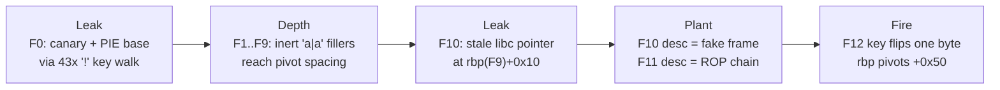
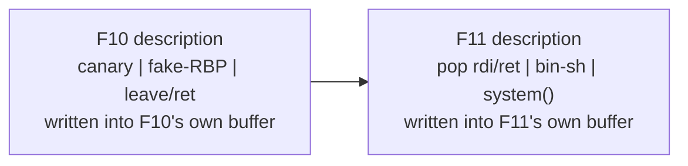
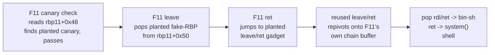

**Category:** Pwn  
**Binary:** `chal` (x86-64, PIE, Full RELRO, NX, stack canary)  
**Vulnerability:** `strlen`-indexed key-buffer overflow + description off-by-one NUL → canary/PIE/libc leak → RBP pivot into a forged stack frame → `leave;ret` reused as a gadget → `system("/bin/sh")`

## Summary

`chal` implements a tiny recursive-descent parser for a JSON-like subset: `{ "key|description": { ... } }`, where every value must itself be an object (no strings, numbers, or arrays). `do_parse_json_object()` has two bugs:

1. **Key-loop overflow.** The key-append write uses `strlen(local_38)` as the physical index while a *separate* logical counter is what's actually bounds-checked — and that counter gets silently decremented for any non-digit/non-`_` character. Sending enough of those walks the real write index straight past the 40-byte key buffer into the canary, saved RBP, and saved return address, while the logical counter never trips the length check.
2. **Description off-by-one.** A NUL terminator gets written one byte past the 40-byte buffer when the description is exactly 40 bytes long — landing exactly on the canary's always-zero low byte, so it's a free "undo" for the corruption above.

Neither bug gives a clean, arbitrary-address write on its own — Bug 1 only ever writes where a genuine `0x00` already sits in memory. The actual RIP-control primitive comes from a third fact: the **description field's own write is completely unrestricted** (a plain sequential loop, no `strlen` trick, no byte filtering). Pivoting `rbp` — via a single narrow byte-write — to point *into* a different frame's description buffer turns "the stack-protector reads garbage" into "the stack-protector reads whatever we planted," because we now control the buffer it reads from.

Full chain: leak canary + PIE base, recurse to a depth where the stack's own byte layout gives a free saved-RBP pivot, plant a fake frame (canary / fake-RBP / `leave;ret` gadget) in one frame's description field and a `pop rdi;ret` → `"/bin/sh"` → `system()` chain in another's, then let the real frame's own epilogue walk into memory we already wrote. No shellcode, no arbitrary write — just the binary's own `leave;ret` reused as a gadget against itself.

## Vulnerability / Bug

### Bug 1 — `strlen`-indexed key overflow

```c
memset(local_38, 0, 0x28);       // local_38 is a 40-byte stack buffer
local_48 = 0;                    // logical key length
while (true) {
    if (0x26 < local_48)         // checks only the logical length
        print_and_exit("Key is too long");
    local_40 = getchar();
    if (local_40 == '|') break;

    sVar4 = strlen(local_38);    // *physical* write index
    local_38[sVar4] = local_40;  // unconditional write, in-bounds or not
    local_48 = local_48 + 1;

    if (!isdigit(local_40) && local_40 != '_') {
        sVar4 = strlen(local_38);
        local_38[sVar4 - 1] = '_';  // force underscore at the new terminator
        local_48 = local_48 - 1;    // undo the counter increment
    }
}
```

Sending only non-digit, non-`_` bytes (e.g. `!`) keeps `local_48` pinned near zero forever, while `strlen(local_38)` — the real write index — grows without bound. Every character is written unconditionally at the current write-frontier; the correction pass then re-scans with `strlen()` and forces a `0x5f` wherever the *next genuine `0x00`* already sits in memory. If that's the byte right after the one just written, the byte you wrote is destroyed. If a run of genuine non-zero bytes follows instead, `strlen()` walks straight through it — landing the forced `_` far away and leaving your byte, and everything between, completely untouched. That's the whole primitive: **one arbitrary byte, deposited only where a natural NUL wall already exists**, plus a free read of everything in between.

### Bug 2 — description off-by-one NUL

```c
local_48 = 0;
while (true) {
    iVar3 = getchar();
    local_40 = iVar3;
    if (local_40 == '"') break;               // closing quote ends the description
    if (0x27 < local_48)                       // only guards writes *inside* the loop
        print_and_exit("Description is too long");
    local_38[local_48] = local_40;             // fully unrestricted — no strlen trick
    local_48 = local_48 + 1;
}
local_38[local_48] = '\0';                     // unconditional, fires even at local_48==40
```

Forty description bytes leave `local_48 == 40`, so the terminating NUL lands at `local_38[40]` — one byte past the buffer, exactly on the canary's low byte. Since glibc canaries always have a zero low byte, this is a harmless no-op *by itself* — but combined with Bug 1 it becomes the reset button that restores the canary after a leak, letting the connection keep parsing. It also matters for a second reason: **this loop has no `strlen` re-scan at all**, so the description field is the only place in the whole binary offering a fully attacker-controlled, arbitrary-content 40-byte write.

## Stack Layout

<style>
.nj-tbl { border-collapse: collapse; width: 100%; font-family: monospace; font-size: 0.85em; margin: 1em 0; }
.nj-tbl th { background: #2563eb; color: #fff; padding: 6px 10px; text-align: left; border: 1px solid #444; }
.nj-tbl td { padding: 5px 10px; border: 1px solid #444; }
.nj-buf  { background: rgba(34,197,94,0.15);  }
.nj-can  { background: rgba(234,179,8,0.20);  }
.nj-rbp  { background: rgba(249,115,22,0.15); }
.nj-rip  { background: rgba(239,68,68,0.20);  }

@keyframes nj-safe { from { opacity:0; background: rgba(34,197,94,0.08); } to { opacity:1; background: rgba(34,197,94,0.28); } }
@keyframes nj-ov   { from { opacity:0; background: transparent; } 50% { background: rgba(239,68,68,0.75); } to { background: rgba(239,68,68,0.45); } }
@keyframes nj-lk   { from { opacity:0; background: transparent; } 50% { background: rgba(249,115,22,0.85); } to { background: rgba(249,115,22,0.48); } }
@keyframes nj-term { from { opacity:0; } to { opacity:1; background: rgba(99,102,241,0.22); } }

.nj-row { display: flex; align-items: center; margin: 3px 0; font-family: monospace; font-size: 0.82em; }
.nj-lbl { width: 150px; color: #888; flex-shrink: 0; }
.nj-bar { display: flex; gap: 2px; flex-wrap: wrap; }
.nj-cell { width: 22px; height: 22px; display: flex; align-items: center; justify-content: center;
           border: 1px solid #555; border-radius: 2px; font-size: 0.7em; opacity: 0;
           animation-fill-mode: forwards; animation-timing-function: ease-out; animation-duration: 0.35s; }
.nj-cell-safe { animation-name: nj-safe; }
.nj-cell-ov   { animation-name: nj-ov; animation-duration: 0.5s; }
.nj-cell-lk   { animation-name: nj-lk; animation-duration: 0.5s; }
.nj-cell-term { animation-name: nj-term; animation-duration: 0.5s; }
.nj-note { margin-left: 10px; font-size: 0.8em; color: #888; }
</style>

Relative to `local_38`, one recursion frame of `do_parse_json_object` looks like this:

<table class="nj-tbl">
<thead>
<tr><th>Offset (from <code>local_38</code>)</th><th>Size</th><th>Field</th></tr>
</thead>
<tbody>
<tr class="nj-buf"> <td>+0x00–0x27</td><td>40 B</td><td>key / description buffer (<code>local_38</code>)</td></tr>
<tr class="nj-can"> <td>+0x28–0x2f</td><td>8 B</td> <td>stack canary (byte 0 always <code>0x00</code>)</td></tr>
<tr class="nj-rbp"> <td>+0x30–0x37</td><td>8 B</td> <td>saved RBP</td></tr>
<tr class="nj-rip"> <td>+0x38–0x3f</td><td>8 B</td> <td>saved return address</td></tr>
</tbody>
</table>

Recursive frames (one per nested `{...}`) are spaced exactly `0x70` bytes apart, confirmed live in GDB across depths 0–20.

## Exploit Strategy



### Phase 1 — leak the canary and PIE base

A 43-byte key of `!` walks the write-frontier from the start of `local_38` clear through the canary into the saved RBP and return address, using Bug 1's "arbitrary byte at a natural wall" primitive twice:

<div style="margin: 1.2em 0;">
  <div class="nj-row">
    <span class="nj-lbl">buf[0..39]</span>
    <div class="nj-bar">
      <span class="nj-cell nj-cell-safe" style="animation-delay:0.0s;">!</span>
      <span class="nj-cell nj-cell-safe" style="animation-delay:0.05s;">!</span>
      <span class="nj-cell nj-cell-safe" style="animation-delay:0.10s;">!</span>
      <span class="nj-cell nj-cell-safe" style="animation-delay:0.15s;">!</span>
      <span style="margin:0 6px;color:#888;font-size:0.8em;align-self:center;">×40, self-correct to <code>_</code></span>
    </div>
    <span class="nj-note" style="color:#22c55e;">in-bounds — harmless</span>
  </div>
  <div class="nj-row">
    <span class="nj-lbl">canary[0]</span>
    <div class="nj-bar">
      <span class="nj-cell nj-cell-ov" style="animation-delay:0.7s;">!</span>
    </div>
    <span class="nj-note" style="color:#ef4444;">temporary clobber of the canary's zero low byte</span>
  </div>
  <div class="nj-row">
    <span class="nj-lbl">canary[1..7]</span>
    <div class="nj-bar">
      <span class="nj-cell nj-cell-lk" style="animation-delay:1.1s;">c</span>
      <span class="nj-cell nj-cell-lk" style="animation-delay:1.15s;">c</span>
      <span class="nj-cell nj-cell-lk" style="animation-delay:1.20s;">c</span>
      <span class="nj-cell nj-cell-lk" style="animation-delay:1.25s;">c</span>
      <span class="nj-cell nj-cell-lk" style="animation-delay:1.30s;">c</span>
      <span class="nj-cell nj-cell-lk" style="animation-delay:1.35s;">c</span>
      <span class="nj-cell nj-cell-lk" style="animation-delay:1.40s;">c</span>
    </div>
    <span class="nj-note" style="color:#f97316;">genuine — never written, walked past and read back via <code>printf</code></span>
  </div>
  <div class="nj-row">
    <span class="nj-lbl">rip[0..4]</span>
    <div class="nj-bar">
      <span class="nj-cell nj-cell-lk" style="animation-delay:1.9s;">r</span>
      <span class="nj-cell nj-cell-lk" style="animation-delay:1.95s;">r</span>
      <span class="nj-cell nj-cell-lk" style="animation-delay:2.0s;">r</span>
      <span class="nj-cell nj-cell-lk" style="animation-delay:2.05s;">r</span>
      <span class="nj-cell nj-cell-lk" style="animation-delay:2.10s;">r</span>
    </div>
    <span class="nj-note" style="color:#f97316;">genuine PIE-relative return-address bytes (saved RBP walked over silently in between)</span>
  </div>
  <div class="nj-row">
    <span class="nj-lbl">rip[5]</span>
    <div class="nj-bar">
      <span class="nj-cell nj-cell-ov" style="animation-delay:2.5s;">_</span>
    </div>
    <span class="nj-note" style="color:#ef4444;">second forced wall-write — the one byte that's never leaked</span>
  </div>
  <div class="nj-row">
    <span class="nj-lbl">rip[6]</span>
    <div class="nj-bar">
      <span class="nj-cell nj-cell-term" style="animation-delay:2.9s;">\0</span>
    </div>
    <span class="nj-note" style="color:#6366f1;">genuine <code>0x00</code> — canonical PIE addresses always have this, terminates the <code>printf</code></span>
  </div>
</div>

The `Key: %s` print then hands back the full 8-byte canary plus the 5 low bytes of the return address; the two missing high bytes are reconstructed from known constants (stack byte 5 is always `0x7f`-shaped, PIE byte 5 is always `0x55`-shaped on this loader). A 40-byte description afterwards restores canary byte 0 to `0x00` via Bug 2, so the connection survives and keeps parsing.

### Phase 2 — reach a depth with a free RBP pivot

`run_aligned()` manually 64 KB-realigns the stack before `main` ever runs, which pins the low bits of every frame's `rbp` to fixed values at fixed recursion depths — independent of ASLR. At depth 11 (`rbp11`), the saved-RBP slot for the next frame (F12) structurally has byte 0 `== 0x00`: exactly the kind of natural wall Bug 1's write primitive needs. Nine inert `"a|a":{}` frames (F1–F9) exist purely to reach that depth; F10 and F11 do the real work.

### Phase 3 — plant a fake frame and a ROP chain

The description field's unrestricted write (Bug 2's loop, not Bug 1's) is used twice, in two different frames:



Both frames' description fields sit downstream of `rbp11`, at fixed offsets once the pivot fires — so the two plants are placed to line up exactly with what a pivoted F11 will read as its own canary, saved RBP, and saved return address.

### Phase 4 — fire the pivot and hijack control flow

A 40-byte key on F12 (`!`×40 + `A` + `P`) uses Bug 1's primitive one more time: it flips F12's saved-RBP low byte from its natural `0x00` to `0x50` (`'P'`). When F12 returns, F11 resumes running with `rbp = rbp11 + 0x50` instead of its own real frame — every subsequent `rbp`-relative read now lands inside F10's planted description buffer instead of F11's real canary/RBP/return slots.



Nothing here is shellcode and nothing is an arbitrary-address write — the binary's own `leave; ret` epilogue is executed twice, once for real and once as a reused gadget, walking through memory the exploit already controls via the two frames' description fields. The resulting shell reads `/flag.txt`.

An earlier pass at this binary (kept in `exploit_notes.md` and `rbp_pivot_writeup.md` in the challenge folder) concluded full RIP control was *unachievable* with these two bugs — that proof only considered writing a fake return address directly through the key-loop's `strlen`-walk primitive, which is indeed too coarse for that. It never considered landing the pivoted `rbp` *inside* a controlled description buffer instead, which is what actually closes the gap.

## Mitigations

| Mitigation | Status | Impact |
|---|---|---|
| PIE | Enabled | Bypassed — leaked via the key-loop's OOB read in Phase 1 |
| Full RELRO | Enabled | GOT not targeted; exploit reuses the binary's own code instead |
| NX | Enabled | No shellcode — `system()` reached via a reused `leave;ret` and a `pop rdi;ret` gadget |
| Stack canary | Enabled | Leaked in Phase 1, restored via Bug 2 after each corruption, and re-planted verbatim in the forged frame so the pivoted check still passes |
| Stack canary low-byte-zero convention | Enabled | Actively exploited — it's the "natural wall" Bug 1's write primitive lands on |
