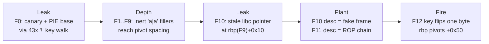

**Category:** Pwn  
**Binary:** `chal` (x86-64, PIE, Full RELRO, NX, stack canary)  
**Vulnerability:** `strlen`-indexed key-buffer overflow + description off-by-one NUL → canary/PIE/libc leak → RBP pivot into a forged stack frame → `leave;ret` reused as a gadget → `system("/bin/sh")`

## Summary

`chal` implements a tiny recursive-descent parser for a JSON-like subset: `{ "key|description": { ... } }`, where every value must itself be an object (no strings, numbers, or arrays). `do_parse_json_object()` has two bugs:

1. **Key-loop overflow.** The key-append write uses `strlen(local_38)` as the physical index while a *separate* logical counter is what's actually bounds-checked — and that counter gets silently decremented for any non-digit/non-`_` character. Sending enough of those walks the real write index straight past the 40-byte key buffer into the canary, saved RBP, and saved return address, while the logical counter never trips the length check.
2. **Description off-by-one.** A NUL terminator gets written one byte past the 40-byte buffer when the description is exactly 40 bytes long — landing exactly on the canary's always-zero low byte, so it's a free "undo" for the corruption above.

Neither bug gives a clean, arbitrary-address write on its own — Bug 1 only ever writes where a genuine `0x00` already sits in memory. The actual RIP-control primitive comes from a third fact: the **description field's own write is completely unrestricted** (a plain sequential loop, no `strlen` trick, no byte filtering). Pivoting `rbp` — via a single narrow byte-write — to point *into* a different frame's description buffer turns "the stack-protector reads garbage" into "the stack-protector reads whatever we planted," because we now control the buffer it reads from.

Full chain: leak canary + PIE base, recurse to a depth where the stack's own byte layout gives a free saved-RBP pivot, plant a fake frame (canary / fake-RBP / `leave;ret` gadget) in one frame's description field and a `pop rdi;ret` → `"/bin/sh"` → `system()` chain in another's, then let the real frame's own epilogue walk into memory we already wrote. No shellcode, no arbitrary write — just the binary's own `leave;ret` reused as a gadget against itself.

## Vulnerability / Bug

### Bug 1 — `strlen`-indexed key overflow

```c
memset(local_38, 0, 0x28);       // local_38 is a 40-byte stack buffer
local_48 = 0;                    // logical key length
while (true) {
    if (0x26 < local_48)         // checks only the logical length
        print_and_exit("Key is too long");
    local_40 = getchar();
    if (local_40 == '|') break;

    sVar4 = strlen(local_38);    // *physical* write index
    local_38[sVar4] = local_40;  // unconditional write, in-bounds or not
    local_48 = local_48 + 1;

    if (!isdigit(local_40) && local_40 != '_') {
        sVar4 = strlen(local_38);
        local_38[sVar4 - 1] = '_';  // force underscore at the new terminator
        local_48 = local_48 - 1;    // undo the counter increment
    }
}
```

Sending only non-digit, non-`_` bytes (e.g. `!`) keeps `local_48` pinned near zero forever, while `strlen(local_38)` — the real write index — grows without bound. Every character is written unconditionally at the current write-frontier; the correction pass then re-scans with `strlen()` and forces a `0x5f` wherever the *next genuine `0x00`* already sits in memory. If that's the byte right after the one just written, the byte you wrote is destroyed. If a run of genuine non-zero bytes follows instead, `strlen()` walks straight through it — landing the forced `_` far away and leaving your byte, and everything between, completely untouched. That's the whole primitive: **one arbitrary byte, deposited only where a natural NUL wall already exists**, plus a free read of everything in between.

### Bug 2 — description off-by-one NUL

```c
local_48 = 0;
while (true) {
    iVar3 = getchar();
    local_40 = iVar3;
    if (local_40 == '"') break;               // closing quote ends the description
    if (0x27 < local_48)                       // only guards writes *inside* the loop
        print_and_exit("Description is too long");
    local_38[local_48] = local_40;             // fully unrestricted — no strlen trick
    local_48 = local_48 + 1;
}
local_38[local_48] = '\0';                     // unconditional, fires even at local_48==40
```

Forty description bytes leave `local_48 == 40`, so the terminating NUL lands at `local_38[40]` — one byte past the buffer, exactly on the canary's low byte. Since glibc canaries always have a zero low byte, this is a harmless no-op *by itself* — but combined with Bug 1 it becomes the reset button that restores the canary after a leak, letting the connection keep parsing. It also matters for a second reason: **this loop has no `strlen` re-scan at all**, so the description field is the only place in the whole binary offering a fully attacker-controlled, arbitrary-content 40-byte write.

## Stack Layout

<style>
.nj-tbl { border-collapse: collapse; width: 100%; font-family: monospace; font-size: 0.85em; margin: 1em 0; }
.nj-tbl th { background: #2563eb; color: #fff; padding: 6px 10px; text-align: left; border: 1px solid #444; }
.nj-tbl td { padding: 5px 10px; border: 1px solid #444; }
.nj-buf  { background: rgba(34,197,94,0.15);  }
.nj-can  { background: rgba(234,179,8,0.20);  }
.nj-rbp  { background: rgba(249,115,22,0.15); }
.nj-rip  { background: rgba(239,68,68,0.20);  }

@keyframes nj-safe { from { opacity:0; background: rgba(34,197,94,0.08); } to { opacity:1; background: rgba(34,197,94,0.28); } }
@keyframes nj-ov   { from { opacity:0; background: transparent; } 50% { background: rgba(239,68,68,0.75); } to { background: rgba(239,68,68,0.45); } }
@keyframes nj-lk   { from { opacity:0; background: transparent; } 50% { background: rgba(249,115,22,0.85); } to { background: rgba(249,115,22,0.48); } }
@keyframes nj-term { from { opacity:0; } to { opacity:1; background: rgba(99,102,241,0.22); } }

.nj-row { display: flex; align-items: center; margin: 3px 0; font-family: monospace; font-size: 0.82em; }
.nj-lbl { width: 150px; color: #888; flex-shrink: 0; }
.nj-bar { display: flex; gap: 2px; flex-wrap: wrap; }
.nj-cell { width: 22px; height: 22px; display: flex; align-items: center; justify-content: center;
           border: 1px solid #555; border-radius: 2px; font-size: 0.7em; opacity: 0;
           animation-fill-mode: forwards; animation-timing-function: ease-out; animation-duration: 0.35s; }
.nj-cell-safe { animation-name: nj-safe; }
.nj-cell-ov   { animation-name: nj-ov; animation-duration: 0.5s; }
.nj-cell-lk   { animation-name: nj-lk; animation-duration: 0.5s; }
.nj-cell-term { animation-name: nj-term; animation-duration: 0.5s; }
.nj-note { margin-left: 10px; font-size: 0.8em; color: #888; }
</style>

Relative to `local_38`, one recursion frame of `do_parse_json_object` looks like this:

<table class="nj-tbl">
<thead>
<tr><th>Offset (from <code>local_38</code>)</th><th>Size</th><th>Field</th></tr>
</thead>
<tbody>
<tr class="nj-buf"> <td>+0x00–0x27</td><td>40 B</td><td>key / description buffer (<code>local_38</code>)</td></tr>
<tr class="nj-can"> <td>+0x28–0x2f</td><td>8 B</td> <td>stack canary (byte 0 always <code>0x00</code>)</td></tr>
<tr class="nj-rbp"> <td>+0x30–0x37</td><td>8 B</td> <td>saved RBP</td></tr>
<tr class="nj-rip"> <td>+0x38–0x3f</td><td>8 B</td> <td>saved return address</td></tr>
</tbody>
</table>

Recursive frames (one per nested `{...}`) are spaced exactly `0x70` bytes apart, confirmed live in GDB across depths 0–20.

## Exploit Strategy



### Phase 1 — leak the canary and PIE base

A 43-byte key of `!` walks the write-frontier from the start of `local_38` clear through the canary into the saved RBP and return address, using Bug 1's "arbitrary byte at a natural wall" primitive twice:

<div style="margin: 1.2em 0;">
  <div class="nj-row">
    <span class="nj-lbl">buf[0..39]</span>
    <div class="nj-bar">
      <span class="nj-cell nj-cell-safe" style="animation-delay:0.0s;">!</span>
      <span class="nj-cell nj-cell-safe" style="animation-delay:0.05s;">!</span>
      <span class="nj-cell nj-cell-safe" style="animation-delay:0.10s;">!</span>
      <span class="nj-cell nj-cell-safe" style="animation-delay:0.15s;">!</span>
      <span style="margin:0 6px;color:#888;font-size:0.8em;align-self:center;">×40, self-correct to <code>_</code></span>
    </div>
    <span class="nj-note" style="color:#22c55e;">in-bounds — harmless</span>
  </div>
  <div class="nj-row">
    <span class="nj-lbl">canary[0]</span>
    <div class="nj-bar">
      <span class="nj-cell nj-cell-ov" style="animation-delay:0.7s;">!</span>
    </div>
    <span class="nj-note" style="color:#ef4444;">temporary clobber of the canary's zero low byte</span>
  </div>
  <div class="nj-row">
    <span class="nj-lbl">canary[1..7]</span>
    <div class="nj-bar">
      <span class="nj-cell nj-cell-lk" style="animation-delay:1.1s;">c</span>
      <span class="nj-cell nj-cell-lk" style="animation-delay:1.15s;">c</span>
      <span class="nj-cell nj-cell-lk" style="animation-delay:1.20s;">c</span>
      <span class="nj-cell nj-cell-lk" style="animation-delay:1.25s;">c</span>
      <span class="nj-cell nj-cell-lk" style="animation-delay:1.30s;">c</span>
      <span class="nj-cell nj-cell-lk" style="animation-delay:1.35s;">c</span>
      <span class="nj-cell nj-cell-lk" style="animation-delay:1.40s;">c</span>
    </div>
    <span class="nj-note" style="color:#f97316;">genuine — never written, walked past and read back via <code>printf</code></span>
  </div>
  <div class="nj-row">
    <span class="nj-lbl">rip[0..4]</span>
    <div class="nj-bar">
      <span class="nj-cell nj-cell-lk" style="animation-delay:1.9s;">r</span>
      <span class="nj-cell nj-cell-lk" style="animation-delay:1.95s;">r</span>
      <span class="nj-cell nj-cell-lk" style="animation-delay:2.0s;">r</span>
      <span class="nj-cell nj-cell-lk" style="animation-delay:2.05s;">r</span>
      <span class="nj-cell nj-cell-lk" style="animation-delay:2.10s;">r</span>
    </div>
    <span class="nj-note" style="color:#f97316;">genuine PIE-relative return-address bytes (saved RBP walked over silently in between)</span>
  </div>
  <div class="nj-row">
    <span class="nj-lbl">rip[5]</span>
    <div class="nj-bar">
      <span class="nj-cell nj-cell-ov" style="animation-delay:2.5s;">_</span>
    </div>
    <span class="nj-note" style="color:#ef4444;">second forced wall-write — the one byte that's never leaked</span>
  </div>
  <div class="nj-row">
    <span class="nj-lbl">rip[6]</span>
    <div class="nj-bar">
      <span class="nj-cell nj-cell-term" style="animation-delay:2.9s;">\0</span>
    </div>
    <span class="nj-note" style="color:#6366f1;">genuine <code>0x00</code> — canonical PIE addresses always have this, terminates the <code>printf</code></span>
  </div>
</div>

The `Key: %s` print then hands back the full 8-byte canary plus the 5 low bytes of the return address; the two missing high bytes are reconstructed from known constants (stack byte 5 is always `0x7f`-shaped, PIE byte 5 is always `0x55`-shaped on this loader). A 40-byte description afterwards restores canary byte 0 to `0x00` via Bug 2, so the connection survives and keeps parsing.

### Phase 2 — reach a depth with a free RBP pivot

`run_aligned()` manually 64 KB-realigns the stack before `main` ever runs, which pins the low bits of every frame's `rbp` to fixed values at fixed recursion depths — independent of ASLR. At depth 11 (`rbp11`), the saved-RBP slot for the next frame (F12) structurally has byte 0 `== 0x00`: exactly the kind of natural wall Bug 1's write primitive needs. Nine inert `"a|a":{}` frames (F1–F9) exist purely to reach that depth; F10 and F11 do the real work.

### Phase 3 — plant a fake frame and a ROP chain

The description field's unrestricted write (Bug 2's loop, not Bug 1's) is used twice, in two different frames: F10's description becomes a fake canary + fake RBP + `leave;ret` gadget address, and F11's description becomes a `pop rdi;ret` → `"/bin/sh"` → `system()` chain. Both are placed at fixed offsets from `rbp11` so that a *pivoted* F11 reads them as its own frame furniture.

`rbp` is really just a bookmark: F11 never remembers *where* its canary or return address live, it just trusts the bookmark and reads from there every time. The whole exploit is **move the bookmark**, then make sure whatever sits where it now points looks like a valid frame:

<style>
.nj-diagram{ margin:1.4em 0; padding:18px 16px 14px; border:1px solid rgba(120,120,120,0.25); border-radius:10px; overflow-x:auto; }
.nj-toolbar{ display:flex; align-items:center; gap:8px; flex-wrap:wrap; margin-bottom:12px; font-family:monospace; }
.nj-btn{ font-family:monospace; font-size:12px; font-weight:600; padding:6px 12px; border-radius:6px; cursor:pointer;
         background:rgba(120,120,120,0.12); border:1px solid rgba(120,120,120,0.35); color:inherit; }
.nj-btn:hover{ border-color:#e0a458; }
.nj-btn:disabled{ opacity:.4; cursor:default; }
.nj-btn.primary{ background:#e0a458; border-color:#e0a458; color:#1c1d24; }
.nj-status{ font-family:monospace; font-size:12px; opacity:.7; min-width:14ch; }
.nj-diagram svg{ display:block; margin-inline:auto; max-width:100%; height:auto; }
#njBig .real{ fill:rgba(34,197,94,0.14); stroke:#22a06b; }
#njBig .real-txt{ fill:#1a8f63; }
#njBig .planted{ fill:rgba(224,164,88,0.16); stroke:#c9873a; }
#njBig .planted-txt{ fill:#b3792f; }
#njTravelDot{ opacity:0; }
#njBig.animating #njTravelDot{ opacity:1; }
@keyframes njLandPulse{ 0%{ filter:none; } 30%{ filter:drop-shadow(0 0 7px #e0a458); } 100%{ filter:none; } }
#njBig.landed .nj-landing{ animation:njLandPulse 1s ease-out; }
@media (prefers-reduced-motion:reduce){ #njTravelAnim{ display:none; } #njBig.landed .nj-landing{ animation:none; } }
</style>

<div class="nj-diagram" id="njBig">
  <div class="nj-toolbar">
    <button class="nj-btn primary" id="njBigPlay" type="button">&#9654; Watch the bookmark move</button>
    <span class="nj-status" id="njBigStatus"></span>
  </div>
  <svg viewBox="0 0 760 300" role="img" aria-label="Before, F11's rbp bookmark points at its own real canary, saved RBP and saved return address. After F12's pivot fires, the same bookmark points 0x50 bytes away into F10's description buffer, landing on a planted canary, planted fake RBP and planted leave-ret address arranged in exactly that shape.">
    <defs>
      <marker id="njArr" viewBox="0 0 10 10" refX="8" refY="5" markerWidth="7" markerHeight="7" orient="auto-start-reverse">
        <path d="M0,0 L10,5 L0,10 z" fill="currentColor"/>
      </marker>
    </defs>
    <g font-family="monospace" font-size="12.5">
      <text x="130" y="20" text-anchor="middle" font-size="13" font-weight="700" fill="currentColor">BEFORE — normal return</text>
      <text x="560" y="20" text-anchor="middle" font-size="13" font-weight="700" fill="#c9873a">AFTER — F12's pivot fires</text>
      <line x1="360" y1="6" x2="360" y2="270" stroke="currentColor" stroke-opacity=".15"/>

      <g transform="translate(20,90)">
        <rect class="real" x="0" y="0" width="180" height="38" rx="4"/>
        <text class="real-txt" x="90" y="24" text-anchor="middle">F11's real canary</text>
        <rect class="real" x="0" y="38" width="180" height="38" rx="4"/>
        <text class="real-txt" x="90" y="62" text-anchor="middle">F11's real saved RBP</text>
        <rect class="real" x="0" y="76" width="180" height="38" rx="4"/>
        <text class="real-txt" x="90" y="100" text-anchor="middle">F11's real saved ret</text>
      </g>
      <path d="M 270 128 H 210" stroke="currentColor" stroke-width="1.6" fill="none" marker-end="url(#njArr)"/>
      <text x="275" y="124" fill="currentColor">rbp11 (the bookmark)</text>

      <g transform="translate(480,58)">
        <rect x="0" y="0" width="180" height="26" rx="4" fill="none" stroke="#c9873a" stroke-opacity=".5" stroke-dasharray="2 3"/>
        <text x="90" y="18" text-anchor="middle" font-size="10.5" fill="#c9873a" opacity=".8">filler "J"</text>
        <rect class="planted nj-landing" x="0" y="26" width="180" height="38" rx="4"/>
        <text class="planted-txt" x="90" y="50" text-anchor="middle" font-weight="600">planted canary</text>
        <rect class="planted nj-landing" x="0" y="64" width="180" height="38" rx="4"/>
        <text class="planted-txt" x="90" y="88" text-anchor="middle" font-weight="600">planted fake RBP</text>
        <rect class="planted nj-landing" x="0" y="102" width="180" height="38" rx="4"/>
        <text class="planted-txt" x="90" y="126" text-anchor="middle" font-weight="600">planted leave/ret addr</text>
        <rect x="0" y="140" width="180" height="26" rx="4" fill="none" stroke="#c9873a" stroke-opacity=".5" stroke-dasharray="2 3"/>
        <text x="90" y="158" text-anchor="middle" font-size="10.5" fill="#c9873a" opacity=".8">filler "K"</text>
      </g>
      <path d="M 700 84 H 665" stroke="#c9873a" stroke-width="1.6" fill="none" marker-end="url(#njArr)"/>
      <text x="690" y="73" text-anchor="middle" font-size="11" fill="#c9873a">rbp11+0x50</text>

      <path id="njConnector" d="M 270 128 C 360 128, 360 84, 475 84" stroke="#d1654a" stroke-width="1.6" fill="none" stroke-dasharray="5 4" marker-end="url(#njArr)" color="#d1654a"/>
      <text x="372" y="112" text-anchor="middle" font-size="11" fill="#d1654a" font-weight="600">F12's leave pops +0x50</text>
      <text x="372" y="126" text-anchor="middle" font-size="11" fill="#d1654a" font-weight="600">into the RBP register</text>

      <circle id="njTravelDot" r="6" fill="#d1654a">
        <animateMotion id="njTravelAnim" dur="1.1s" begin="indefinite" fill="freeze" keyPoints="0;1" keyTimes="0;1" calcMode="spline" keySplines="0.4 0 0.2 1">
          <mpath href="#njConnector"/>
        </animateMotion>
      </circle>

      <text x="110" y="200" text-anchor="middle" font-size="11" fill="currentColor" opacity=".55">reads exactly what it should</text>
      <text x="570" y="200" text-anchor="middle" font-size="11" fill="currentColor" opacity=".55">reads F10's furniture instead — built to match</text>
    </g>
  </svg>
</div>

<script>
(function(){
  var wrap = document.getElementById("njBig");
  if(!wrap) return;
  var play = document.getElementById("njBigPlay");
  var status = document.getElementById("njBigStatus");
  var anim = document.getElementById("njTravelAnim");
  var reduceMotion = window.matchMedia && window.matchMedia("(prefers-reduced-motion: reduce)").matches;
  var busy = false;
  play.addEventListener("click", function(){
    if(busy) return;
    busy = true; play.disabled = true;
    wrap.classList.remove("landed"); wrap.classList.add("animating");
    status.textContent = "rbp11 -> rbp11+0x50 ...";
    function done(){
      anim.removeEventListener("endEvent", done);
      wrap.classList.remove("animating"); wrap.classList.add("landed");
      status.textContent = "landed on F10's planted frame";
      play.disabled = false; busy = false;
    }
    if(reduceMotion){ setTimeout(done, 50); }
    else {
      anim.addEventListener("endEvent", done);
      try { anim.beginElement(); } catch(e){ setTimeout(done, 1100); }
      setTimeout(function(){ if(busy) done(); }, 1600);
    }
  });
})();
</script>

### Phase 4 — fire the pivot and hijack control flow

A 40-byte key on F12 (`!`×40 + `A` + `P`) uses Bug 1's primitive one more time: it flips F12's saved-RBP low byte from its natural `0x00` to `0x50` (`'P'`). When F12 returns, F11 resumes running with `rbp = rbp11 + 0x50` instead of its own real frame — every subsequent `rbp`-relative read now lands inside F10's planted description buffer instead of F11's real canary/RBP/return slots. Step through what F11 does next, one popped qword at a time:

<style>
#njStep .nj-row, #njStep .nj-hop, #njStep .nj-seg{ transition:opacity .25s ease; }
#njStep.stepping .nj-row{ opacity:.22; }
#njStep.stepping .nj-hop{ opacity:.28; }
#njStep.stepping .nj-seg{ opacity:.15; }
#njStep.stepping .nj-row.active{ opacity:1; }
#njStep.stepping .nj-hop.active{ opacity:1; }
#njStep.stepping .nj-hop.active circle{ stroke-width:2.4; filter:drop-shadow(0 0 5px #d1654a); }
#njStep.stepping .nj-seg.active{ opacity:1; stroke-width:2.4; }
@media (prefers-reduced-motion:reduce){ #njStep .nj-row, #njStep .nj-hop, #njStep .nj-seg{ transition:none; } }
.nj-real2{ fill:rgba(34,197,94,0.10); stroke:#22a06b; stroke-opacity:.6; }
.nj-planted2{ fill:rgba(224,164,88,0.16); stroke:#c9873a; }
.nj-caption{ font-family:sans-serif; font-size:14px; line-height:1.55; padding:10px 14px; margin-top:10px;
             border-left:3px solid #d1654a; border-radius:0 6px 6px 0; background:rgba(120,120,120,0.08); min-height:1.5em; }
</style>

<div class="nj-diagram" id="njStep">
  <div class="nj-toolbar">
    <button class="nj-btn" id="njPrev" type="button">&#9664; Prev</button>
    <button class="nj-btn primary" id="njPlay" type="button">&#9654; Play</button>
    <button class="nj-btn" id="njNext" type="button">Next &#9654;</button>
    <button class="nj-btn" id="njReset" type="button">Reset</button>
    <span class="nj-status" id="njStepLabel">Overview</span>
  </div>
  <svg viewBox="0 0 780 480" role="img" aria-label="A byte-offset map relative to rbp11 tracing eight numbered control-flow hops through F11's planted ROP chain and F10's planted fake frame.">
    <defs>
      <marker id="njArrS" viewBox="0 0 10 10" refX="8" refY="5" markerWidth="6" markerHeight="6" orient="auto-start-reverse">
        <path d="M0,0 L10,5 L0,10 z" fill="#d1654a"/>
      </marker>
    </defs>
    <g font-family="monospace" font-size="12">
      <g class="nj-row" id="nj-row-m30" transform="translate(0,20)">
        <text x="118" y="19" text-anchor="end" opacity=".65">rbp11 − 0x30</text>
        <rect class="nj-planted2" x="130" y="2" width="230" height="28" rx="4"/>
        <text x="140" y="19" fill="#c9873a" font-weight="600">pop rdi;ret</text>
        <text x="390" y="19" font-size="10.5" opacity=".55">F11 chain[0] · read by 6</text>
      </g>
      <g class="nj-row" id="nj-row-m28" transform="translate(0,56)">
        <text x="118" y="19" text-anchor="end" opacity=".65">rbp11 − 0x28</text>
        <rect class="nj-planted2" x="130" y="2" width="230" height="28" rx="4"/>
        <text x="140" y="19" fill="#c9873a" font-weight="600">"/bin/sh"</text>
        <text x="390" y="19" font-size="10.5" opacity=".55">chain[8] · popped into rdi at 7</text>
      </g>
      <g class="nj-row" id="nj-row-m20" transform="translate(0,92)">
        <text x="118" y="19" text-anchor="end" opacity=".65">rbp11 − 0x20</text>
        <rect class="nj-planted2" x="130" y="2" width="230" height="28" rx="4"/>
        <text x="140" y="19" fill="#c9873a" font-weight="600">system()</text>
        <text x="390" y="19" font-size="10.5" opacity=".55">chain[16] · read by 8</text>
      </g>
      <g class="nj-row" transform="translate(0,128)">
        <text x="118" y="19" text-anchor="end" opacity=".5">rbp11 − 0x08</text>
        <rect class="nj-real2" x="130" y="2" width="230" height="28" rx="4"/>
        <text x="140" y="19" opacity=".7">F11's real canary — never read</text>
      </g>
      <g class="nj-row" transform="translate(0,164)">
        <text x="118" y="19" text-anchor="end" opacity=".5">rbp11 + 0x00</text>
        <rect class="nj-real2" x="130" y="2" width="230" height="28" rx="4"/>
        <text x="140" y="19" opacity=".7">F11's real saved RBP — never popped</text>
      </g>
      <g class="nj-row" transform="translate(0,200)">
        <text x="118" y="24" text-anchor="end" opacity=".45">rbp11 +0x08..+0x3f</text>
        <rect x="130" y="4" width="230" height="26" rx="4" fill="none" stroke="currentColor" stroke-opacity=".18" stroke-dasharray="3 4"/>
        <text x="245" y="21" text-anchor="middle" font-size="10.5" opacity=".45">F11's real ret + F12's frame — untouched</text>
      </g>
      <g class="nj-row" id="nj-row-p48" transform="translate(0,244)">
        <text x="118" y="19" text-anchor="end" opacity=".65">rbp11 + 0x48</text>
        <rect class="nj-planted2" x="130" y="2" width="230" height="28" rx="4"/>
        <text x="140" y="19" fill="#c9873a" font-weight="600">canary (from F0's leak)</text>
        <text x="390" y="19" font-size="10.5" opacity=".55">read by 2 — the check that must pass</text>
      </g>
      <g class="nj-row" id="nj-row-p50" transform="translate(0,280)">
        <text x="118" y="19" text-anchor="end" opacity=".65">rbp11 + 0x50</text>
        <rect class="nj-planted2" x="130" y="2" width="230" height="28" rx="4"/>
        <text x="140" y="19" fill="#c9873a" font-weight="600">fake RBP = rbp11 − 0x38</text>
        <text x="390" y="19" font-size="10.5" opacity=".55">popped by 3</text>
      </g>
      <g class="nj-row" id="nj-row-p58" transform="translate(0,316)">
        <text x="118" y="19" text-anchor="end" opacity=".65">rbp11 + 0x58</text>
        <rect class="nj-planted2" x="130" y="2" width="230" height="28" rx="4"/>
        <text x="140" y="19" fill="#c9873a" font-weight="600">leave;ret gadget addr</text>
        <text x="390" y="19" font-size="10.5" opacity=".55">popped by 4 · reused binary code</text>
      </g>

      <g font-size="11" fill="#d1654a">
        <g class="nj-hop" id="nj-hop-2"><circle cx="700" cy="258" r="11" fill="none" stroke="#d1654a" stroke-width="1.6"/><text x="700" y="262" text-anchor="middle">2</text></g>
        <g class="nj-hop" id="nj-hop-3"><circle cx="700" cy="294" r="11" fill="none" stroke="#d1654a" stroke-width="1.6"/><text x="700" y="298" text-anchor="middle">3</text></g>
        <g class="nj-hop" id="nj-hop-4"><circle cx="700" cy="330" r="11" fill="none" stroke="#d1654a" stroke-width="1.6"/><text x="700" y="334" text-anchor="middle">4</text></g>
        <g class="nj-hop" id="nj-hop-5"><circle cx="700" cy="34" r="11" fill="none" stroke="#d1654a" stroke-width="1.6"/><text x="700" y="38" text-anchor="middle">5</text></g>
        <g class="nj-hop" id="nj-hop-6"><circle cx="700" cy="70" r="11" fill="none" stroke="#d1654a" stroke-width="1.6"/><text x="700" y="74" text-anchor="middle">6</text></g>
        <g class="nj-hop" id="nj-hop-7"><circle cx="700" cy="106" r="11" fill="none" stroke="#d1654a" stroke-width="1.6"/><text x="700" y="110" text-anchor="middle">7</text></g>
        <g class="nj-hop" id="nj-hop-8"><circle cx="700" cy="142" r="11" fill="none" stroke="#d1654a" stroke-width="1.6"/><text x="700" y="146" text-anchor="middle">8</text></g>
        <path class="nj-seg" id="nj-seg-23" d="M700,258 V294" stroke="#d1654a" stroke-width="1.5" fill="none" marker-end="url(#njArrS)"/>
        <path class="nj-seg" id="nj-seg-34" d="M700,294 V330" stroke="#d1654a" stroke-width="1.5" fill="none" marker-end="url(#njArrS)"/>
        <path class="nj-seg" id="nj-seg-45" d="M688,330 C 640 400, 640 -30, 688 34" stroke="#d1654a" stroke-width="1.5" fill="none" marker-end="url(#njArrS)" stroke-dasharray="5 4"/>
        <path class="nj-seg" id="nj-seg-56" d="M700,34 V70" stroke="#d1654a" stroke-width="1.5" fill="none" marker-end="url(#njArrS)"/>
        <path class="nj-seg" id="nj-seg-67" d="M700,70 V106" stroke="#d1654a" stroke-width="1.5" fill="none" marker-end="url(#njArrS)"/>
        <path class="nj-seg" id="nj-seg-78" d="M700,106 V142" stroke="#d1654a" stroke-width="1.5" fill="none" marker-end="url(#njArrS)"/>
      </g>
    </g>
  </svg>
  <div class="nj-caption" id="njCaption">Click &#9654; Play, or step through with Prev / Next, to watch each hop happen in order.</div>
</div>

<script>
(function(){
  var wrap = document.getElementById("njStep");
  if(!wrap) return;
  var steps = [
    { row:"nj-row-p48", hop:"nj-hop-2", seg:null,
      text:"2 &mdash; F11's stack-protector check reads [rbp&minus;8], now rbp11+0x48, and finds the exact canary planted there. The check passes." },
    { row:"nj-row-p50", hop:"nj-hop-3", seg:"nj-seg-23",
      text:"3 &mdash; F11's own leave does rsp = rbp; pop rbp &mdash; it pops the fake RBP out of rbp11+0x50 into the RBP register." },
    { row:"nj-row-p58", hop:"nj-hop-4", seg:"nj-seg-34",
      text:"4 &mdash; The matching ret pops rbp11+0x58 as the next instruction pointer: the binary's own leave;ret code, reused as a gadget." },
    { row:null, hop:"nj-hop-5", seg:"nj-seg-45",
      text:"5 &mdash; That reused leave;ret now runs with rsp = fake_rbp. Its pop rbp reads stale F11 scratch data at rbp11&minus;0x38 (just above the chain below), discarded." },
    { row:"nj-row-m30", hop:"nj-hop-6", seg:"nj-seg-56",
      text:"6 &mdash; Its ret pops rbp11&minus;0x30: the first qword of F11's own description buffer, the pop rdi;ret gadget address." },
    { row:"nj-row-m28", hop:"nj-hop-7", seg:"nj-seg-67",
      text:"7 &mdash; pop rdi loads rbp11&minus;0x28 into rdi: the address of the string \"/bin/sh\"." },
    { row:"nj-row-m20", hop:"nj-hop-8", seg:"nj-seg-78",
      text:"8 &mdash; The gadget's own ret pops rbp11&minus;0x20 as the next instruction pointer: libc's system(). Called with rdi=\"/bin/sh\". Shell." }
  ];
  var OVERVIEW = "Click ▶ Play, or step through with Prev / Next, to watch each hop happen in order.";
  var idx = -1, playing = null;
  var caption = document.getElementById("njCaption");
  var label = document.getElementById("njStepLabel");
  var playBtn = document.getElementById("njPlay");

  function render(){
    wrap.querySelectorAll(".active").forEach(function(el){ el.classList.remove("active"); });
    if(idx < 0){
      wrap.classList.remove("stepping");
      caption.innerHTML = OVERVIEW;
      label.textContent = "Overview";
      return;
    }
    wrap.classList.add("stepping");
    var s = steps[idx];
    if(s.row) document.getElementById(s.row).classList.add("active");
    document.getElementById(s.hop).classList.add("active");
    if(s.seg) document.getElementById(s.seg).classList.add("active");
    caption.innerHTML = s.text;
    label.textContent = "Step " + (idx+1) + " / " + steps.length;
  }
  function stop(){ if(playing){ clearInterval(playing); playing = null; playBtn.innerHTML = "&#9654; Play"; } }

  document.getElementById("njPrev").addEventListener("click", function(){ stop(); idx = Math.max(-1, idx-1); render(); });
  document.getElementById("njNext").addEventListener("click", function(){ stop(); idx = Math.min(steps.length-1, idx+1); render(); });
  document.getElementById("njReset").addEventListener("click", function(){ stop(); idx = -1; render(); });
  playBtn.addEventListener("click", function(){
    if(playing){ stop(); return; }
    if(idx >= steps.length-1) idx = -1;
    playBtn.innerHTML = "&#10074;&#10074; Pause";
    var reduceMotion = window.matchMedia && window.matchMedia("(prefers-reduced-motion: reduce)").matches;
    function stepOnce(){ idx += 1; if(idx >= steps.length){ stop(); return; } render(); }
    stepOnce();
    playing = setInterval(stepOnce, reduceMotion ? 400 : 1900);
  });
  render();
})();
</script>

Nothing here is shellcode and nothing is an arbitrary-address write — the binary's own `leave; ret` epilogue is executed twice, once for real and once as a reused gadget, walking through memory the exploit already controls via the two frames' description fields. The resulting shell reads `/flag.txt`.

An earlier pass at this binary (kept in `exploit_notes.md` and `rbp_pivot_writeup.md` in the challenge folder) concluded full RIP control was *unachievable* with these two bugs — that proof only considered writing a fake return address directly through the key-loop's `strlen`-walk primitive, which is indeed too coarse for that. It never considered landing the pivoted `rbp` *inside* a controlled description buffer instead, which is what actually closes the gap.

## Mitigations

| Mitigation | Status | Impact |
|---|---|---|
| PIE | Enabled | Bypassed — leaked via the key-loop's OOB read in Phase 1 |
| Full RELRO | Enabled | GOT not targeted; exploit reuses the binary's own code instead |
| NX | Enabled | No shellcode — `system()` reached via a reused `leave;ret` and a `pop rdi;ret` gadget |
| Stack canary | Enabled | Leaked in Phase 1, restored via Bug 2 after each corruption, and re-planted verbatim in the forged frame so the pivoted check still passes |
| Stack canary low-byte-zero convention | Enabled | Actively exploited — it's the "natural wall" Bug 1's write primitive lands on |
